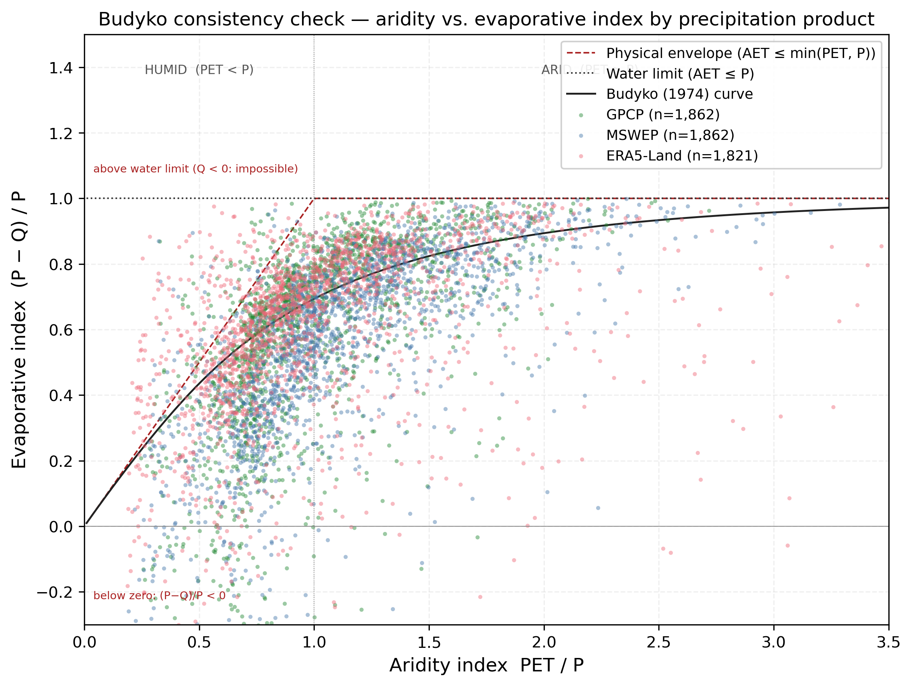

# CAMELS-RU: A Large-Sample Hydroclimatic Dataset for 3,353 Russian Catchments

**Dmitrii V. Abramov** ^1^ [ORCID: 0000-0003-2682-8722]

^1^ International Center for Corporate Data Analysis, Astana, Kazakhstan

*Correspondence: dmbrmv@icloud.com*

---

## Abstract

We present CAMELS-RU, a large-sample hydrological dataset for 3,353 catchments across the Russian Federation following the CAMELS framework (Addor et al., 2017). Its cumulative drainage area of ~17.1 million km² covers the largest landmass previously absent from the global CAMELS network.
The dataset integrates quality-controlled daily discharge from 2,170 gauging stations and water level records from 2,989 gauges (2008–2023) obtained from the Automated Information System of State Monitoring of Water Bodies (AIS GMVO).
Meteorological forcing combines MSWEP v2.8 precipitation (Beck et al., 2019), ERA5-Land temperature (Muñoz-Sabater et al., 2021), and GLEAM4 potential evapotranspiration (Miralles et al., 2025); GPCP v3.3 (Huffman, 2024) and ERA5-Land precipitation serve as independent cross-validation references.
Each of the 3,353 watershed boundaries was manually verified against official Roshydromet data (mean areal error 5.1%, median 1.4%, n=3,011 with reference area), and 288 HydroATLAS-derived attributes (Linke et al., 2019) were computed per catchment.
Fifteen hydrological signatures are released for 1,845 catchments (after removing 17 small-basin anomalies; main-text statistics and the signature maps in Figures 8 and 9 use a 1,716-gauge strict-completeness subset, see Sect. 3.5) and characterize discharge magnitude, variability, timing, extremes, and climate–water-balance consistency, including a Budyko aridity/evaporative pair.
Water-balance sanity checks against ERA5-Land precipitation yield runoff ratios ≤ 1 for 98.6% of catchments (median 0.260), an upper-bound closure consistent with (but inflated by) the known ERA5-Land high-latitude wet bias (Sect. 4).
No prior CAMELS-standard dataset covers the Russian Federation (Table 1); the global Caravan compilation (Kratzert et al., 2023) reuses existing regional CAMELS derivatives and excludes Russian gauges.
The dataset is available at *[DOI: to be assigned upon Zenodo upload]*.

---

## 1 Introduction

### 1.1 Large-Sample Hydrology and the CAMELS Framework

Large-sample hydrology relies on comparative analyses across many catchments to identify controls on hydrological behavior (Addor et al., 2017).
The CAMELS (Catchment Attributes and MEteorology for Large-sample Studies) framework has generated regional derivatives worldwide (Table 1), including CAMELS-GB (Coxon et al., 2020), CAMELS-BR (Chagas et al., 2020), CAMELS-CL (Alvarez-Garreton et al., 2018), CAMELS-AUS (Fowler et al., 2021), LamaH-CE (Klingler et al., 2021), CAMELS-DE (Höge et al., 2024), and the global Caravan compilation (Kratzert et al., 2023).
Each of these datasets provides daily discharge, meteorological forcing, and physiographic attributes on a common schema, which has enabled cross-catchment model benchmarking (Kratzert et al., 2019) and prediction in ungauged basins (Wagener et al., 2004).

**Table 1.** Comparison of CAMELS-RU with existing CAMELS-family datasets.

| Dataset | Region | Catchments | Period | Attributes / Signatures | Area (km²) |
|---------|--------|------------|--------|------------------------|-------------|
| CAMELS | USA | 671 | 1980–2014 | 59 / 13 | 4–25,000 |
| CAMELS-CL | Chile | 516 | 1913–2016 | 70 / 13 | 5–35,000 |
| CAMELS-AUS | Australia | 222 | 1951–2014 | 134 / 13 | 52–520,000 |
| CAMELS-GB | Great Britain | 671 | 1970–2015 | 290 / 13 | 1–10,000 |
| CAMELS-BR | Brazil | 897 | 1980–2018 | 65 / 13 | 6–500,000 |
| LamaH-CE | Central Europe | 859 | 1981–2017 | 61 / – | 1–132,000 |
| CAMELS-DE | Germany | 1,582 | 1951–2020 | 69 / 13 | 1–54,000 |
| Caravan | Global | 6,830 | varies | 38 / 13 | varies |
| **CAMELS-RU** | **Russia** | **3,353** | **2008–2023** | **22 (288)^†^ / 15** | **0.49–2,670,000** |

^†^ 22 primary attributes selected by removing highly correlated features (|r| > 0.7); 288 total HydroATLAS-derived attributes provided per catchment.

### 1.2 The Russian Federation: An Unrepresented Region

Russian catchments cover continuous-permafrost tundra through semi-arid steppe, yet no large-sample dataset following CAMELS standards currently exists for the Russian Federation.
Russian hydrological records remain fragmented across institutional archives and non-standardized formats.
The closure of the AIS GMVO public data platform in 2025 adds urgency to preserving and standardizing hydrological records for this region.

### 1.3 Objectives

Our objectives are to:

1. document data acquisition, processing, and quality control;
2. compute hydrological signatures that characterize discharge across Russian catchments;
3. validate meteorological forcing through inter-dataset comparisons and water-balance consistency; and
4. provide open-access data records following FAIR principles (Wilkinson et al., 2016).

---

## 2 Study Area

The study encompasses 3,353 catchments with delineated watersheds across the Russian Federation, spanning latitudes 41.2°N–73.0°N and longitudes 19.9°E–178.3°E (Figure 1).
Catchment areas range from 0.49 km² to 2,670,000 km² (median: 2,817 km²), with small-to-medium basins (100–10,000 km²) comprising 60% of the dataset.
Catchments are distributed across major drainage basins: the Volga (European Russia), Ob and Yenisei (Western and Central Siberia), Lena (Eastern Siberia), and Amur (Far East), plus smaller Arctic and Pacific coastal drainages.

The dataset covers Köppen zones ET/Dfc (tundra/subarctic), Dfb (continental), and BSk (semi-arid steppe).
Mean annual precipitation is 350–1,100 mm yr⁻¹; mean annual temperature −10 to +10°C.
Snow cover persists 60–250+ days depending on latitude; permafrost is absent in the south but continuous in northeastern Siberia.
These gradients drive contrasting hydrological regimes: snowmelt-dominated pulses in the permafrost zone versus baseflow-sustained flow in temperate forests (Sect. 4).

Mean catchment elevations range from −28 to 2,997 m (HydroATLAS `ele_mt_uav`); negative values correspond to Caspian-draining basins below mean sea level, and high elevations to headwaters in the Caucasus, Altai, and Sayan ranges.
Boreal taiga dominates in the north (up to 95% forest), while southern steppe catchments are predominantly agricultural (up to 85% cropland); urban fraction reaches 35% near major cities.
Soils range between clay-rich Chernozems in agricultural lowlands and sandy Podzols in permafrost terrain.

**Figure 1.** (a) Spatial distribution of 3,353 catchments colored by discharge quality grade (A–F, blue to red; triangles denote hydropower stations; "ungraded" markers (n=1,286) comprise 1,183 catchments with a delineated boundary but no discharge record and 103 discharge-bearing gauges with too few assessed years to assign an overall grade). (b) Catchment size distribution. Higher gauge density in European Russia and southern Siberia reflects Roshydromet's operational network.

---

## 3 Data Sources and Methods

### 3.1 Hydrological Data: AIS GMVO

#### 3.1.1 Data Source and Selection Criteria

Daily discharge and water level observations were obtained from the Automated Information System of State Monitoring of Water Bodies (AIS GMVO), operated by Roshydromet (Roshydromet, 2023).
The database provides stage-discharge records for approximately 3,000 active gauging stations across Russia.
After delineation, 3,353 unique watershed boundaries were produced. Of these, 2,170 have discharge records and 2,989 have water level records (2,158 have both, yielding 3,001 unique gauge locations with at least one variable; the remaining 352 watersheds have delineated boundaries and physiographic attributes but no hydrological time series in the current release).

Selection criteria:

- Minimum 10 years of available records between 2008–2023
- Data completeness ≥ 95% with ≤ 2 minor quality flags for high-quality subset (849 Grade A gauges)
- Quality flags indicating operational sensors and regular maintenance

Quality tiers are assigned by the automated grading procedure described below: *decent quality* gauges receive overall grades A–C; the *high-quality* subset comprises Grade A gauges (≥ 95% completeness, ≤ 2 minor flags).
Overall, 87% of discharge gauges meet the decent quality threshold, with the high-quality subset comprising 849 gauges (detailed data organization in Sect. 5).

The 2008–2023 period was selected because systematic digitization and standardized reporting procedures were implemented across Roshydromet's network during this period.

#### 3.1.2 Quality Control

Each discharge time series was assessed through a quality control procedure operating at annual (hydrological year) resolution.
The procedure evaluates four categories of quality metrics:

1. **Anomaly detection:** Outliers flagged when values exceed 8 robust standard deviations (median absolute deviation, MAD × 1.4826) from a 30-day centered rolling median; the rationale for the 8σ cutoff is given below. Constant-value periods (> 30 consecutive days) flagged separately. Negative discharge values rejected.

2. **Climatology checks:** Each year compared against a day-of-year climatology (mean across all years). Metrics include Pearson correlation with climatology, normalized RMSE, and amplitude ratio (peak discharge / climatological peak). For catchments with seasonal flow regimes (75th-percentile peak ratio ≥ 10), years with peak ratio < 30% of the gauge's 75th-percentile peak ratio are flagged as critical failures, targeting sensor malfunction rather than genuine low-flow years. Stable-regime catchments are exempted from this check.

3. **Meteorological response:** Precipitation events (> 5 mm d⁻¹) are matched against discharge response within a 7-day window (10% increase threshold). Cross-correlation between daily P and Q computed at lags 0–14 days to identify the dominant response time. The Richards–Baker flashiness index quantifies flow variability. Thresholds are set conservatively low (cross-correlation > 0.1, event response rate > 20%) to avoid penalizing snowmelt-dominated catchments where precipitation–discharge coupling is inherently weak.

4. **Gap-filling:** Gaps ≤ 6 days interpolated using second-order polynomial interpolation; longer gaps retained as missing. Interpolated values producing negative discharge set to missing.

Each year is graded A–D or F (grade E omitted to avoid ambiguity with "Excellent" in common grading conventions) based on flag severity (critical, major, minor; 18 flags defined, 16 active — two variance-based flags are disabled because annual discharge variance varies naturally in snowmelt-dominated catchments). The grade is assigned as:

| Grade | Condition (applied top-down; first match wins) |
|-------|-----------|
| F | Any critical flag |
| D | ≥ 2 major flags, or completeness < 70% |
| C | 1 major flag, or ≥ 5 minor flags, or completeness < 85% |
| B | ≥ 3 minor flags (< 5), or completeness < 95% |
| A | ≤ 2 minor flags and completeness ≥ 95% |
Gauge-level grades aggregate year-level results with a strict Grade A rule: a gauge receives overall Grade A only if every assessed hydro-year is individually graded A. For grades B–D, the mode of non-F year grades is used, capped by (i) the fraction of usable years — usable fraction < 50% caps at D, < 70% caps at C — and (ii) the fraction of F-graded years, which caps at B once the F fraction exceeds 30% to prevent high headline grades at gauges with frequent critical failures.
Gauges with overall grade A–C are classified as *decent quality* (87% of discharge gauges); grades D–F as *poor*.
The resulting grade distribution and data completeness by grade are shown in Figure 2; discharge and water level characteristics by grade are summarized in Figure 3.

The 8σ outlier threshold was chosen because snowmelt-dominated Russian catchments routinely produce spring discharge peaks 20–50× winter baseflow. Tighter thresholds (3σ, 5σ) flag the large majority of gauges, yet spot-checks of flagged values show that these "outliers" are predominantly genuine flood peaks rather than sensor errors. The 8σ threshold was selected as a conservative, regime-specific screening value that balances detection of true anomalies against preservation of genuine flood peaks; a seasonally stratified or hydrograph-shape-based detector would be more principled but was beyond the scope of this dataset release.

Discharge was standardized to mm d⁻¹ by dividing volumetric flow (m³ s⁻¹) by catchment area.

#### 3.1.3 Water Level Processing

Daily water level records (2,989 gauges, including 152 hydropower and reservoir gauges) were parsed from AIS GMVO exports with the following QC:
zero values (instrument artifacts) were replaced with day-of-year medians computed from non-zero observations at the same gauge;
gaps ≤ 6 days were interpolated using second-order polynomial interpolation (reservoir gauges: ≤ 15 days);
multi-source records for the same gauge were merged using preferential selection (latest correction takes precedence).
All water levels are in centimetres, referenced to the Baltic Height System 1977 (BHS-77) as reported in AIS GMVO metadata.
No automated quality grading (A–F) was applied to water level data; users should assess completeness per gauge before use.

**Figure 2.** Quality assessment summary: (a) grade distribution for discharge gauges (bars labeled "Levels" show water level record availability at co-located gauges; water level data itself is not graded; the "ungraded" column counts discharge gauges for which too few hydro-years pass the assessment criteria to assign an overall grade), (b) missing discharge data percentage by grade, (c) gauge variable overlap (discharge-only, level-only, both), (d) dataset summary statistics.

**Figure 3.** Discharge and water level characteristics across quality grades: (a) discharge record length, (b) mean discharge, (c) discharge variability (CV), (d) water level record length, (e) mean water level, (f) level range. Based on 2,170 discharge gauges and 2,837 water level gauges (152 hydropower stations excluded from level panels).

### 3.2 Meteorological Forcing Data

#### 3.2.1 ERA5-Land Temperature

Air-temperature forcing (mean, minimum, maximum; °C) was derived from ERA5-Land reanalysis (Muñoz-Sabater et al., 2021), which provides 0.1° (~9 km) hourly data aggregated to daily resolution. Basin-averaged temperature was computed with a two-branch aggregation that switches on a 150 km² area threshold: catchments below 150 km² use fractional-area weighting of ERA5-Land grid cells intersecting the watershed boundary (weights normalised to unity); catchments at or above 150 km² use a simple spatial mean of grid cells whose footprint touches the boundary (`all_touched=True` clip), because partial-cell edge effects become negligible once a basin spans many grid cells. Temperatures are reported on the native ERA5-Land geometry without elevation correction; users requiring elevation-adjusted temperatures for high-relief basins should apply a lapse-rate correction downstream using the `ele_mt_uav` attribute (Table 2). ERA5-Land precipitation (mean annual 826 mm yr⁻¹) is retained internally for cross-validation (Sect. 4.1) but is not distributed in the release, where MSWEP v2.8 serves as the primary precipitation product.

#### 3.2.2 GLEAM Potential Evapotranspiration

Potential evapotranspiration (PET, mm d⁻¹) was taken from GLEAM4 (Miralles et al., 2025), which provides daily land-surface evaporation fields at 0.1° resolution based on a modified Priestley–Taylor formulation scaled by a multiplicative evaporative-stress factor, with forcing drawn from satellite observations and reanalysis meteorology. We use the `potential_evaporation` variable (which represents reference-surface potential evaporation) and aggregate to catchment scale using the same two-branch procedure as for temperature (Sect. 3.2.1). GLEAM's independent forcing chain avoids the self-consistency issues that arise when PET is taken from the same reanalysis product that supplies precipitation (Sect. 4.1.2). Approximately 2.4% of the released `pet` values are slightly negative (minimum −0.19 mm d⁻¹), reflecting wintertime condensation at high latitudes in GLEAM's formulation; users requiring a strictly non-negative PET should clip values below zero.

#### 3.2.3 MSWEP Precipitation

Precipitation data were sourced from Multi-Source Weighted-Ensemble Precipitation (MSWEP) version 2.8 (Beck et al., 2019), a global precipitation dataset merging gauge observations, satellite estimates, and reanalysis data at 0.1° resolution.
Mean annual precipitation: 608 mm yr⁻¹ across CAMELS-RU catchments.
MSWEP outperforms reanalysis-only products in gauge-sparse and snowfall-dominated regions (Beck et al., 2019).
Daily precipitation (mm d⁻¹) aggregated to catchment scale using the two-branch procedure described in Sect. 3.2.1.

#### 3.2.4 Inter-Dataset Validation

Three precipitation products (ERA5-Land, MSWEP v2.8, GPCP v3.3) were cross-validated to assess forcing reliability.
Daily correlations range from r = 0.58 (ERA5-Land vs. GPCP) to r = 0.83 (ERA5-Land vs. MSWEP), with systematic differences in annual totals reflecting different data sources and spatial resolutions (see Sect. 4).

#### 3.2.5 Gap-Filling

The released forcing file `camels_ru_forcing.nc` provides 100% coverage across all 3,353 gauges and 5,844 days for the five target variables (`precip_mswep`, `temp_mean`, `temp_min`, `temp_max`, `pet`). MSWEP precipitation and GLEAM4 PET required no fill. ERA5-Land temperature required fill for 24 gauges (0.7% of the gauge network) with one of two origins.

Seven gauges sit east of 170°E in far-eastern Chukotka and fall outside the longitude range of the 2008–2022 ERA5-Land tiles retained locally, which extend to 170.00°E. Daily values for 2008–2022 at these gauges were extracted from the raw ERA5-Land dataset at the easternmost valid land cell at each gauge's bounding-box midpoint latitude. One gauge at 69.6°N (gauge 1611) required a 1° westward shift to 169°E because the 170°E cell at that latitude sits in Chaunskaya Bay and is masked as ocean by ERA5-Land. The 2023 values at these gauges were retained from the native basin aggregation, as the 2023 tiles cover a wider longitude range extending to 179°E.

Seventeen gauges have full coverage for 2008–2022 but carry a complete 2023 temperature gap due to a partial-download anomaly in the 2023 ERA5-Land tiles (tile size ~334 MB versus ~616 MB for 2022, with ~37% spatial NaN concentrated in small-basin regions). For these gauges a day-of-year climatology fill was applied: each missing day in 2023 was replaced by the mean of values at the same day-of-year across the 15 donor years 2008–2022. All 17 gauges carried the full 15 donor years, well above the three-year minimum threshold set for this procedure.

GPCP precipitation used for the inter-dataset comparison in Sect. 4.1 carries 1–1.4% scattered single-day NaN values in 1,584 gauges, an aggregation artefact of the product's 0.5° resolution against small basin polygons. The annual statistics reported in Sect. 4.1 drop these values pairwise rather than imputing; the bias introduced by missing-at-random NaNs at this fraction is below 0.5% and does not affect the qualitative conclusions.

Per-gauge fill provenance is traceable through three artefacts: the `gap_fill_method` and `gap_fill_n_gauges_affected` global attributes on `camels_ru_forcing.nc`; the `forcing_note` column in `camels_ru_gauge_summary.csv` (populated for the filled gauges that appear in the discharge-gauge summary); and `camels_ru_forcing_notes.csv` shipped in the release directory listing all 24 filled gauges with their exact fill method and coordinates.

### 3.3 Watershed Boundaries: Manual Verification

#### 3.3.1 Base Delineation

Initial catchment boundaries delineated using the MERIT Hydro digital elevation model (DEM; Yamazaki et al., 2019) (3-arcsecond, ~90 m resolution globally) and associated flow direction/accumulation grids.
MERIT Hydro reduces elevation errors in flat and forested terrain compared to earlier global DEMs by incorporating satellite altimetry and river network constraints.

Gauge coordinates were snapped to the nearest high-accumulation pixel on the MERIT Hydro flow network; candidate pixels were accepted when their upstream drainage area fell within ±20% of the Roshydromet-reported catchment area.
Watershed delineation used the standard D8 flow routing algorithm, after which every boundary was inspected and adjusted manually (Sect. 3.3.2), giving a post-hoc mean areal error of 5.1% relative to Roshydromet (median 1.4%; n=3,011 of 3,353 catchments with a reported reference area).

#### 3.3.2 Manual Expert Verification

Every watershed boundary (3,353 catchments) was manually verified and adjusted by a hydrographic expert using:

- High-resolution satellite imagery (Google Earth, Sentinel-2 10 m)
- MERIT Hydro river network overlay
- Official Roshydromet topographic maps (1:100,000 scale)
- Local terrain knowledge and hydrographic principles

Manual adjustments corrected:

- DEM artifacts in flat terrain (West Siberian Lowland, river deltas)
- Flow direction errors at confluences and braided reaches
- Canal diversions and reservoirs altering natural drainage
- Karst hydrology and subsurface flow contributions

#### 3.3.3 Validation Against Official Data

Comparison with official Roshydromet catchment areas, computed on the 3,011 of 3,353 catchments with a reported reference area, yielded:

- Mean absolute areal error: 5.1% (trimmed mean over |error| ≤ 100%, excluding 26 pathological gauges in karst or canal-modified basins)
- Median absolute areal error: 1.4%
- 77% of catchments within 5% error
- 87% of catchments within 10% error
- Largest errors (> 15%) occur in complex karst terrain (Ural Mountains) and anthropogenically modified basins (irrigation canals, inter-basin transfers)

For comparison, Lehner et al. (2008) and Yamazaki et al. (2019) report 10–15% mean areal errors from automated delineation in flat and permafrost terrain.

Known limitations of the dataset (temporal coverage, nested catchments, attribute temporal mismatch, and others) are consolidated in Sect. 5.4.

### 3.4 Physiographic Attributes: HydroATLAS

For each of the 3,353 manually verified catchment boundaries, all variables from the HydroATLAS v1.0 database (Linke et al., 2019) were extracted by spatially aggregating raster layers within watershed polygons using area-weighted averaging.
This produces 288 catchment-specific attribute values spanning hydrology, physiography, climate (including monthly temperature and precipitation), land cover, soil and geology, and anthropogenic variables.
HydroATLAS v1.0 uses HydroBASINS Level 12 as its smallest geographic unit (~10 km² median); 14 of our catchments fall below this grid and therefore lack HydroATLAS coverage, yielding 3,339 catchments with attributes in the released file.
The full attribute set is provided in the released CSV file.

Table 2 lists a recommended primary subset of 22 attributes selected by retaining upstream-aggregated annual variables and removing 12 features with pairwise |r| > 0.7 (e.g., slope correlated with elevation; aridity index redundant with precipitation and potential evapotranspiration, PET).
All removed attributes — including aridity index, slope, temperature, and soil properties — remain available in the full released attribute file for users who need them.

**Table 2.** Static catchment attributes derived from HydroATLAS v1.0 (22 primary subset). The full set of 288 attributes is provided in the released CSV.

| Category | Attribute | Unit | Description |
|----------|-----------|------|-------------|
| Climate & water balance | ele_mt_uav | m | Mean elevation |
| | pre_mm_uyr | mm yr⁻¹ | Mean annual precipitation |
| | pet_mm_uyr | mm yr⁻¹ | Mean annual potential evapotranspiration |
| | aet_mm_uyr | mm yr⁻¹ | Mean annual actual evapotranspiration |
| | snw_pc_uyr | % | Mean annual snow cover extent |
| Land cover | for_pc_use | % | Forest cover |
| | crp_pc_use | % | Cropland cover |
| | pst_pc_use | % | Pasture/grassland cover |
| | ire_pc_use | % | Irrigated area |
| | pac_pc_use | % | Protected area coverage |
| Cryosphere | gla_pc_use | % | Glacier cover |
| | prm_pc_use | % | Permafrost extent |
| Soil | cly_pc_uav | % | Clay content (mean) |
| | slt_pc_uav | % | Silt content (mean) |
| | snd_pc_uav | % | Sand content (mean) |
| Hydrogeology | gwt_cm_sav | cm | Groundwater table depth |
| | kar_pc_use | % | Karst area extent |
| Water bodies | inu_pc_ult | % | Inundation extent |
| | lka_pc_use | % | Lake/reservoir area |
| Human impact | ppd_pk_uav | pers/km² | Population density |
| | urb_pc_use | % | Urban/built-up area |
| | gdp_ud_sav | USD/km² | GDP density |

*All attributes are watershed-level aggregates computed individually for each manually verified catchment boundary using area-weighted spatial averaging. Attribute codes follow HydroATLAS naming: suffix indicates aggregation (uav = upstream area-weighted average, use = upstream spatial extent, uyr = upstream annual mean, sav = sub-basin average, ult = upstream ultimate).*

### 3.5 Hydrological Signatures

We computed 15 hydrological signatures (Table 3) characterizing discharge magnitude, variability, timing, extremes, and climate–water-balance consistency (the Budyko aridity and evaporative pair; Budyko, 1974), following established methodologies (Sawicz et al., 2011; McMillan et al., 2017).
Signatures were computed only for catchments smaller than 50,000 km² (to avoid spatial averaging in very large basins) that also meet the per-year completeness criterion (> 70% for at least 5 hydrological years).
This yields **N = 1,716 gauges** for magnitude, variability, baseflow, and extreme signatures, and **N = 1,641 gauges** for the half-flow date, which requires the stricter > 82% annual completeness (≥ 300 days).
The released `camels_ru_signatures.csv` (per gauge × per hydrological year) and `camels_ru_signatures_summary.csv` (multi-year averages per gauge) additionally include 146 gauges that pass the area and ≥ 5-year discharge filters but use a less strict per-year completeness accounting (operating on the release-level `camels_ru_discharge.nc` rather than on intermediate processed records), yielding 1,862 rows total in the per-gauge CSV (and 1,655 rows for half-flow date, which retains the ≥ 82% annual-completeness requirement); these extra gauges are retained for transparency but are excluded from the N = 1,716 / 1,641 main-text summary statistics and figures.
Separately, 17 very small catchments (< 50 km²) yield implausibly large specific discharge (q_mean > 20 mm d⁻¹), likely reflecting rating-curve extrapolation errors or underestimated drainage areas at the small-basin end of the MERIT Hydro delineation; these are flagged `is_anomalous = True` in the per-gauge CSV and removed before computing the released `camels_ru_signatures_summary.csv` (which therefore reports n_gauges = 1,845 for most signatures and 1,643 for half-flow date; cf. §5.1).

Signatures were computed separately for individual hydrological years (October–September) and then averaged to produce catchment-characteristic values.
Key methodological choices:

- Runoff ratio uses ERA5-Land precipitation as denominator; ratios are higher with MSWEP (median 0.40) or GPCP (median 0.35) due to their lower annual precipitation totals. Note that the released `camels_ru_signatures_summary.csv` reports an ERA5-Land runoff-ratio median of 0.343 over the small-basin signature subset (1,804 catchments after `is_anomalous` removal), which differs from the §4.1.2 median of 0.260 computed over the ~2,070 discharge-bearing catchments with paired annual Q and P — small basins systematically have higher runoff ratios than large ones because of lower transit-time evapotranspiration losses
- Flow duration curve (FDC) slope computed as [ln(Q₃₃) − ln(Q₆₆)] / (66 − 33) × 100 where Qₚ is discharge at the p-th exceedance percentile; positive values indicate steeper curves (note: sign convention opposite to Sawicz et al., 2011)
- Baseflow index (BFI) computed as the mean of an ensemble of 1,000 Lyne–Hollick digital filter (Nathan and McMahon, 1990) runs with α ~ U[0.9, 0.98] (3-pass, with 30 reflected boundary points at each end to reduce edge effects), following Euser et al. (2013)
- Half-flow date requires > 82% annual completeness (≥ 300 days) because partial years can shift the cumulative midpoint
- Richards–Baker flashiness index: Σ|Qᵢ − Qᵢ₋₁| / ΣQᵢ, dimensionless measure of day-to-day flow variability
- High-flow and low-flow durations: mean consecutive days above 2× median (high) or below 0.2× mean (low) discharge

**Table 3.** Hydrological signatures computed for CAMELS-RU catchments.

| Signature | Unit | Description |
|-----------|------|-------------|
| **Magnitude** | | |
| q_mean | mm d⁻¹ | Mean daily discharge |
| runoff_ratio | – | Annual Q/P ratio (ERA5-Land precipitation) |
| **Variability** | | |
| q_cv | – | Coefficient of variation of daily discharge |
| FDC_slope | – | FDC slope between 33rd and 66th exceedance percentiles (log-space; positive = steeper) |
| flashiness_index | – | Richards–Baker index: Σ\|Qᵢ−Qᵢ₋₁\|/ΣQᵢ |
| **Extremes** | | |
| Q₀₅ | mm d⁻¹ | 5th exceedance percentile (high flows) |
| Q₉₅ | mm d⁻¹ | 95th exceedance percentile (low flows) |
| high_flow_freq | % of days | Days exceeding 2× median discharge |
| high_flow_dur | days | Mean duration of high-flow events (> 2× median) |
| **Baseflow** | | |
| baseflow_index | – | Baseflow fraction; ensemble of 1,000 Lyne–Hollick filter runs, α ~ U[0.9, 0.98], 3-pass |
| **Low Flow** | | |
| low_flow_freq | % of days | Days below 0.2× mean discharge |
| low_flow_dur | days | Mean duration of low-flow events (< 0.2× mean) |
| **Seasonality** | | |
| half_flow_date | day of hydro yr | Day of hydrological year (Oct 1 = day 1) when 50% of annual streamflow volume has passed |
| **Climate / Water Balance** | | |
| aridity_index | – | Aridity index PET/P (GLEAM4 PET, ERA5-Land P; mean of annual ratios) |
| evaporative_index | – | Evaporative index (P−Q)/P (ERA5-Land P; mean of annual ratios; satisfies 1 − runoff_ratio identity) |

---

## 4 Technical Validation

### 4.1 Precipitation Dataset Intercomparison

#### 4.1.1 Inter-Dataset Correlations

Daily precipitation time series from three global products (ERA5-Land, MSWEP v2.8, GPCP v3.3) show agreement across 3,353 catchments. Daily statistics (spatial mean ± s.d. of per-catchment values, n = 3,353) and the corresponding per-catchment annual biases shown in Figure 5 are:

- ERA5-Land vs. MSWEP: r = 0.83 ± 0.06, mean daily bias +0.83 mm d⁻¹; per-catchment annual bias +229 mm yr⁻¹ (ERA5-Land wetter)
- ERA5-Land vs. GPCP: r = 0.58 ± 0.12, mean daily bias +0.68 mm d⁻¹; per-catchment annual bias +182 mm yr⁻¹ (ERA5-Land wetter)
- MSWEP vs. GPCP: r = 0.73 ± 0.15, mean daily bias −0.14 mm d⁻¹; per-catchment annual bias −47 mm yr⁻¹ (MSWEP drier)

Daily biases and annual biases are computed from different unit aggregations and need not scale by 365: daily biases average over every catchment-day pair, while annual biases average the catchment-mean annual totals across catchments. The two are reported together so that readers can match the text to Figure 5.

ERA5-Land and MSWEP show the highest daily agreement (r = 0.83); correlations with GPCP are lower (r = 0.58 to 0.73). GPCP's 0.5° grid averages over sub-grid variability that the 0.1° products resolve, and the three products draw on different source data.
Systematic biases in annual totals reflect different data assimilation approaches. Summary statistics below characterize the *spatial* distribution of basin-mean annual precipitation across all 3,353 catchments (each catchment's mean was first computed over 2008–2023 and then aggregated across catchments):

| Dataset | Mean (mm yr⁻¹) | Std (mm yr⁻¹) | Spatial CV (%) |
|---------|---------------|---------------|-----------------|
| ERA5-Land | 826 | 263 | 31.8 |
| MSWEP | 608 | 214 | 35.2 |
| GPCP | 644 | 198 | 30.7 |

ERA5 precipitation is a model forecast product, and its prognostic cloud microphysics scheme tends to overestimate snowfall at high latitudes (Wang et al., 2019; Lavers et al., 2022) (Figure 4).
ERA5-Land (826 mm yr⁻¹) exceeds MSWEP (608 mm yr⁻¹) by 218 mm yr⁻¹ in basin-averaged means (229 mm yr⁻¹ per-catchment annual bias; Figure 5), and exceeds GPCP (644 mm yr⁻¹) by 182 mm yr⁻¹ in basin-averaged means (also 182 mm yr⁻¹ per-catchment annual bias; Figure 5).
MSWEP and GPCP differ by only 36 mm yr⁻¹ in basin-averaged means (47 mm yr⁻¹ per-catchment annual bias), identifying ERA5-Land as the outlier.

**Figure 4.** Spatial distribution of mean annual precipitation from three global products (ERA5-Land, MSWEP v2.8, GPCP v3.3) across CAMELS-RU catchments. ERA5-Land shows systematically higher values, particularly in mountainous and northern regions.

**Figure 5.** Inter-dataset precipitation agreement: scatter plots of mean annual precipitation (mm yr⁻¹) for each catchment. Annotations show Pearson r and mean bias for the annual values. Note that daily correlations (reported in text) differ from these annual correlations.

#### 4.1.2 Water Balance Consistency

Runoff ratios (Q/P) provide a consistency check on precipitation products through water balance closure.
ERA5-Land inherits ERA5 precipitation, which is generated by model physics rather than observation assimilation and tends to overestimate high-latitude snowfall (Wang et al., 2019).
Because ERA5-Land supplies both precipitation and temperature (PET is drawn independently from GLEAM4, see Sect. 3.2.2), this analysis tests partial internal consistency on the ERA5-Land side rather than providing fully independent validation:

| Dataset | Median Q/P | Mean Q/P | Q/P > 1 (%) |
|---------|-----------|----------|-------------|
| ERA5-Land | 0.260 | 0.302 | 1.4% (29 gauges) |
| MSWEP | 0.398 | 0.453 | 5.5% (114 gauges) |
| GPCP | 0.353 | 0.433 | 6.3% (130 gauges) |

With ERA5-Land precipitation, 98.6% of catchments yield Q/P ≤ 1 (median 0.260; Figure 6).
This high closure rate is an upper-bound sanity check rather than a validation of discharge or catchment boundaries: because ERA5-Land is known to overestimate high-latitude snowfall, its Q/P denominator is inflated, and a low Q/P > 1 rate is in part a tautology given the wet bias.
The 29 ERA5-Land exceptions (1.4%) are concentrated in small catchments with possible area errors or groundwater imports.
MSWEP, which has lower annual totals, produces Q/P > 1 for 5.5% of catchments (114 gauges); these exceptions are more informative and may reflect precipitation underestimation in high-discharge regions, watershed boundary errors, or unaccounted lateral flows.

Seasonal runoff ratios (ERA5-Land) reveal expected snowmelt dominance:

- Winter (DJF): Q/P = 0.15 (snow storage phase)
- Spring (MAM): Q/P = 0.48 (snowmelt release, 3.2× winter)
- Summer (JJA): Q/P = 0.18 (high evapotranspiration)
- Autumn (SON): Q/P = 0.25 (declining ET, moderate flow)

**Figure 6.** Water balance components across CAMELS-RU catchments: (a) runoff ratio (Q/P) and (b) evapotranspiration proxy (P−Q). ERA5-Land precipitation yields Q/P ≤ 1 for 98.6% of catchments. Only catchments with discharge observations are plotted; precipitation-only stations are omitted.

#### 4.1.3 Budyko Consistency Check and ET Adequacy

The Q/P ratios of Sect. 4.1.2 become a stronger water-balance diagnostic once GLEAM4 PET (Sect. 3.2.2) is incorporated.
Under the long-term water-balance assumption `P = Q + AET` (treating multi-year storage change as negligible), AET is bounded above by PET (energy limit, AET ≤ PET) and by P (water limit, AET ≤ P).
We compute per-hydrological-year aridity index (PET / P) and evaporative index ((P − Q) / P), taken as the mean of annual ratios over ≥ 5 common Q–P–PET hydrological years, for the 1,862 catchments passing the area and discharge-record filters of Sect. 3.5 under each of the three precipitation products (Figure 7).
Valid Budyko indices are obtained for 1,821 catchments with ERA5-Land and 1,862 each with MSWEP and GPCP; the small ERA5-Land shortfall reflects roughly 40 gauges where the ERA5-Land precipitation series fails the ≥ 5 common-year requirement when paired with both Q and PET.

Across products the median aridity index sits near unity (PET/P = 0.92 ERA5-Land, 1.02 MSWEP, 0.92 GPCP), placing the typical Russian catchment at the humid–arid transition; the corresponding evaporative-index medians (0.66 / 0.61 / 0.66) indicate that about two-thirds of precipitation returns to the atmosphere as AET in the long-term mean.
Energy-limit excursions (evaporative_index > aridity_index, equivalent to AET > PET in per-year ratios) affect 8.0% of ERA5-Land catchments (146 gauges), 2.0% under MSWEP (37 gauges), and 3.4% under GPCP (63 gauges); the higher ERA5-Land rate is consistent with the product's known precipitation wet bias, which inflates `(P − Q)` without a matching change in PET.
Closure violations (Q > P, evaporative_index < 0) affect 4.5% / 6.6% / 7.6% of catchments across the three products; the symmetric pattern — ERA5-Land has fewer closure violations but more energy-limit excursions, while MSWEP and GPCP show the opposite — mirrors the direction of the precipitation bias.
GLEAM4 ingests no precipitation forcing from ERA5-Land, MSWEP, or GPCP, so the diagnostic is independent on the precipitation side; GLEAM4 PET is computed via Priestley–Taylor with radiation and air-temperature inputs derived in part from ERA5, so independence from ERA5-Land is only partial.

A complementary direct check on the magnitude of evapotranspiration uses GLEAM4's actual-evaporation field rather than its potential counterpart, on the 1,789 catchments with paired discharge, all three precipitation products, GLEAM PET, and GLEAM AET valid (the slightly tighter sample reflects the additional `area ≥ 50 km²` filter applied to remove anomalous small-basin records).
Long-term annual GLEAM AET has median 442 mm yr⁻¹ (IQR 377–504 across the network), within published estimates for Russia and consistent with the median GLEAM PET of 645 mm yr⁻¹.
The water-balance AET estimate AET_wb = ⟨P⟩ − ⟨Q⟩ in long-term annual terms has medians of 625, 347, and 424 mm yr⁻¹ under ERA5-Land, MSWEP, and GPCP respectively, giving median AET_wb / AET_GLEAM ratios of 1.39, 0.76, and 0.94.
Stated in absolute terms, ERA5-Land implies an AET that exceeds GLEAM PET in 44.9% of catchments — physically impossible in long-term mean without unaccounted import — whereas MSWEP and GPCP exceed GLEAM PET in only 1.5% and 2.9% of catchments.
Both diagnostics point to the same precipitation-side bias and quantify it in mm yr⁻¹, motivating the choice of MSWEP over ERA5-Land as the released precipitation forcing in CAMELS-RU.

The aridity and evaporative indices under ERA5-Land are provided per-gauge in `camels_ru_signatures.csv` as `aridity_index` and `evaporative_index` (Table 3).

**Figure 7.** Budyko consistency check for 1,862 catchments passing the signature-computation filters (Sect. 3.5; valid indices in 1,821 with ERA5-Land, 1,862 each with MSWEP and GPCP). Aridity index PET/P (x-axis; GLEAM4 PET) against evaporative index (P − Q)/P (y-axis), with one point per gauge per precipitation product. Reference lines: red dashed energy limit (AET ≤ PET; envelope min(1, PET/P)), dotted water limit (AET ≤ P at y = 1), and the Budyko (1974) theoretical curve. ERA5-Land catchments cluster systematically above the energy line in the humid regime (PET/P < 1), reflecting the product's known precipitation wet bias.

#### 4.1.4 Precipitation–Discharge Relationship

Linear regression of annual discharge vs. annual precipitation quantifies the marginal streamflow response to precipitation:

$$Q_{\text{annual}} = \alpha + \beta \times P_{\text{annual}}$$

Per-gauge linear regression of annual discharge on annual ERA5-Land precipitation yields a median slope β = 0.290 (mean: 0.332), indicating that on average a 1 mm yr⁻¹ increase in annual precipitation corresponds to a 0.29 mm yr⁻¹ increase in discharge.
The sub-unity slope reflects evapotranspiration buffering and storage changes that dampen the precipitation signal; 2.0% of catchments exceed β = 1.0, concentrated in karst terrain where groundwater imports from adjacent basins may supplement local precipitation inputs.

MSWEP yields a steeper median slope (β = 0.446; 9.7% of catchments > 1), consistent with its lower mean annual precipitation producing a stronger marginal response.

### 4.2 Discharge Quality Control

The 849 high-quality discharge subset undergoes the following validation:

- Physical plausibility: negative discharge values are rejected at parse time; the release contains no negative Q values.
- Mass balance consistency: water-balance residuals (P − Q − ET proxy) are reported per-gauge in the attribute file so that users can screen for non-closing catchments.

Median data completeness: 97.5% (2008–2023), with gaps ≤ 6 days filled by second-order polynomial interpolation (5.2% of station-days); longer gaps are retained as missing to preserve autocorrelation structure.

#### 4.2.1 Consistency Cross-Check Against GRDC Re-Exports

Both CAMELS-RU and the Global Runoff Data Centre (GRDC) archive obtain Russian discharge observations from Roshydromet's gauging network, so a comparison between them is a consistency check on processing (unit conversions, date alignment, gap-filling) rather than independent validation of the underlying observations.
Where temporal overlap permits, CAMELS-RU discharge was compared against GRDC.
Of the 792 Russian stations in GRDC, 16 have daily discharge extending into the 2008–2023 study period; 11 of these matched a CAMELS-RU gauge within 25 km and with a catchment area ratio of 0.5–2.0.
The matched stations are predominantly large rivers (Neva, Northern Dvina, Pechora, Don, Amur, Olenek, Anabar; catchment areas 7,940–2,430,000 km²).

All 11 pairs show median Pearson r = 1.000, median NSE = 1.000, and median PBIAS = 0.0% (range −0.6% to 0.0%; overlap periods 569–5,479 days), consistent with shared provenance.
The single station with slightly lower agreement (Bol'shoy Anyuy at Konstantinovo: r = 0.996, NSE = 0.991, PBIAS = −0.6%) suggests minor differences in gap-handling or data version between the two archives.
No alternative discharge archive exists that would permit independent observational validation for this region and period.

Figures 8 and 9 show spatial patterns of key hydrological signatures for the 1,716 gauges with at least 5 complete hydrological years (out of 2,170 with discharge data); the remaining discharge gauges are omitted from these maps.
Mean annual discharge is highest in mountain headwaters and humid northern forests.
BFI is high in temperate forests (0.6–0.7) and low in permafrost regions (0.2–0.3), reflecting differences in infiltration capacity.
Half-flow date shows a latitudinal gradient from early spring snowmelt in the south to late summer in the permafrost zone.

**Figure 8.** Spatial distribution of magnitude and baseflow signatures for the 1,716 gauges meeting the signature-computation criteria (Sect. 3.5): (a) mean annual discharge, (b) Q₉₅ (low-flow threshold), (c) Q₀₅ (high-flow threshold), (d) baseflow index. Color scales from low (blue) to high (red). Gauges without a computed metric are omitted from the map.

**Figure 9.** Spatial distribution of timing, variability, and extreme signatures for the same 1,716 gauges (strict-completeness subset) as Figure 8; half-flow date panel uses 1,641 of those gauges that also meet the ≥ 82% annual-completeness requirement. Panels: (e) mean half-flow date (day of hydrological year), (f) FDC slope, (g) high-flow frequency, (h) low-flow frequency. Color scales from low (blue) to high (red). Gauges without a computed metric are omitted from the map.

### 4.3 Watershed Boundary Accuracy

As detailed in Sect. 3.3, manual verification of all 3,353 boundaries achieved a mean areal error of 5.1% (median 1.4%) against official Roshydromet data over the 3,011 catchments with a reference area (77% within 5%, 87% within 10%).
The largest improvements over automated delineation occurred in:

- Low-relief floodplains (West Siberian Lowland): DEM artifacts corrected using satellite imagery
- Permafrost regions: Subsurface flow paths verified with expert knowledge
- Regulated systems: Reservoir operations and diversions mapped from infrastructure databases

Per-catchment areal-error statistics are released alongside each boundary in `camels_ru_boundaries.gpkg` so that users can filter by delineation quality for analyses sensitive to catchment area.

---

## 5 Data Records

This section describes the contents, file structure, and intended usage of the CAMELS-RU v1.0 release bundle.

### 5.1 Dataset Composition

The dataset encompasses 3,353 catchments with delineated watersheds across Russia.
Hydrological observations include 2,170 discharge gauging stations and 2,989 water level gauges.
The high-quality subset comprises 849 Grade A gauges (≥ 95% completeness) during 2008–2023.
Overall, 87% of discharge gauges meet the decent quality threshold (see Sect. 3.1 for quality tier definitions).

`camels_ru_discharge.nc` is stored as a `gauge × time` grid covering all 3,353 catchments so that gauge identifiers align with `camels_ru_boundaries.gpkg`; the 1,183 catchments without observed discharge are represented as all-missing rows.

The released signatures CSV (Sect. 3.5) covers 1,862 catchments, of which 17 are flagged `is_anomalous` and excluded from summary statistics, yielding a cleaned subset of 1,845 catchments (1,643 for half-flow date, which retains the ≥ 82% annual-completeness requirement). Across this cleaned subset, catchment-characteristic signatures vary broadly: median q_mean 0.695 mm d⁻¹ (range 0.003–8.35), median BFI 0.556 (0.191–0.903), median FDC slope 2.34 (0.16–13.63), and median half-flow date day 214 of the hydrological year (early May). The 1,716 strict-completeness subset described in §3.5 is a subset of this cleaned set.

### 5.2 Dataset Structure

Table 4 summarizes the released files.
All NetCDF files include CF-compliant metadata with per-variable `units`, `long_name`, and `source` attributes; missing values are encoded as NaN. The `quality_flag` variable in `camels_ru_discharge.nc` distinguishes observed values (0) from missing values (3); gap-filled values (≤ 6 days, second-order polynomial) are written in place of the originals and are not flagged separately — users needing a strict observed-only subset should cross-reference `camels_ru_year_grades.csv` and filter to years graded A.

**Table 4.** Dataset file structure. Total uncompressed size approximately 1.5 GB; gzipped release archive approximately 0.55 GB.

| File | Format | Key variables |
|------|--------|---------------|
| `README.md` | Markdown | Release notes, file descriptions, and citation information |
| `camels_ru_boundaries.gpkg` | GPKG | 3,353 polygons with area, centroid, areal-error columns |
| `camels_ru_discharge.nc` | NetCDF-4 | `discharge_mm` (mm d⁻¹), `discharge_m3s` (m³ s⁻¹), `quality_flag` (0 = observed, 3 = missing); 3,353 × 5,844 d with 2,170 gauges carrying observations |
| `camels_ru_forcing.nc` | NetCDF-4 | `precip_mswep` (MSWEP v2.8, mm d⁻¹), `temp_mean/min/max` (ERA5-Land, °C), `pet` (GLEAM4, mm d⁻¹); 3,353 × 5,844 d, 100% coverage (temperature gaps filled for 24 gauges — see Sect. 3.2.5) |
| `camels_ru_attributes.csv` | CSV | 288 HydroATLAS attributes (22 primary subset); 3,339 catchments (see Sect. 3.4 on the 14 sub-HydroBASINS catchments without coverage) |
| `camels_ru_signatures.csv` | CSV | 15 hydrological signatures per gauge × per hydrological year (includes Budyko aridity and evaporative indices) |
| `camels_ru_signatures_summary.csv` | CSV | 15 catchment-characteristic (multi-year-averaged) signatures per gauge |
| `camels_ru_year_grades.csv` | CSV | Per-gauge × per-hydro-year quality grade (A–F) |
| `camels_ru_gauge_summary.csv` | CSV | Overall grade, year counts, recommendation, `forcing_note` per discharge gauge |
| `camels_ru_forcing_notes.csv` | CSV | Per-gauge fill provenance for the 24 gauges with gap-filled ERA5 temperature (Sect. 3.2.5) |
| `camels_ru_water_level/` | CSV directory | Daily water level (cm, BHS-77 datum) for 2,989 gauges, one CSV per gauge |

### 5.3 Usage Notes

- **Filter by per-year grades before modeling.** For modeling applications, users should consult `camels_ru_year_grades.csv` and filter out individual years with grades D or F, even for gauges with overall grade A or B. This prevents low-quality years in validation windows from corrupting model performance metrics.
- **Quality flags in `camels_ru_discharge.nc`** are encoded as described in §5.2. For a strict observed-only subset, cross-reference `camels_ru_year_grades.csv` and retain only years graded A.
- **Runoff ratios depend on the precipitation product.** ERA5-Land, MSWEP, and GPCP give materially different Q/P medians (Sect. 4.1.2); choose the product whose assumptions match your application.

The dataset is publicly available under CC BY 4.0 license at *[DOI: to be assigned upon Zenodo upload]*.
Processing code is available at https://github.com/HydroInformaticsRu/camels_ru.

### 5.4 Limitations

- **Short temporal coverage:** The 16-year record (2008–2023) constrains multi-decadal trend analysis and captures only one phase of low-frequency climate variability.
- **Single DEM product:** Watershed boundaries derived from MERIT Hydro; manual verification mitigates DEM artifacts, but boundary accuracy in flat or karst terrain remains limited by the underlying elevation data.
- **Nested catchments:** Spatial analysis shows that the majority of gauges are nested within at least one larger catchment, with nesting depths up to 58 levels in major river systems (e.g., Ob basin). The summary statistics reported in this paper (e.g., medians across the 1,716-gauge signature set) are unweighted gauge aggregates and therefore oversample upstream headwaters relative to their independent drainage area; area-weighted or nesting-aware aggregation is left to downstream users. Users must account for nesting to avoid double-counting discharge or overstating sample independence.
- **Attribute temporal mismatch:** HydroATLAS attributes are based on circa-2000 global datasets; land cover and population density may have shifted during 2008–2023.
- **Stationarity assumption:** All hydrological signatures assume stationary catchment behavior, which may not hold for basins undergoing rapid land use change or permafrost degradation.
- **Limited independent discharge validation:** Comparison against the GRDC archive (Sect. 4.2.1) confirms processing correctness but shares the same Roshydromet source data, so it does not constitute independent observational validation. No alternative discharge data source exists for Russia during the 2008–2023 period.
- **Rating-curve uncertainty:** Stage-discharge ratings carry 10–20% uncertainty at high and low flows, which propagates into discharge magnitudes and water-balance residuals.
- **ERA5-Land circularity:** Water-balance closure uses ERA5-Land precipitation, which also serves as forcing input, limiting the independence of this consistency check. ERA5-Land precipitation is known to overestimate high-latitude snowfall (Sect. 4); MSWEP may underestimate solid precipitation in the same regions.
- **Gauge network bias:** Arctic permafrost-dominated catchments and Pacific-draining basins are underrepresented relative to their geographic extent; western European Russia is correspondingly overrepresented.
- **Water level data:** Water level records undergo basic QC (zero replacement, gap interpolation) but lack the automated A–F quality grading applied to discharge data. Users should assess per-gauge completeness before use.
- **Data source continuity:** The AIS GMVO platform, which served as the primary data source, ceased public operation in 2025. CAMELS-RU thus serves as a preservation archive for these discharge and water level records.

### 5.5 Future Updates

Planned dataset enhancements include:

- Extension of temporal coverage using historical records from institute archives and OCR-digitized observation books (from the 1950s to present for a subset of gauges)
- Integration of additional discharge gauges with delineated watersheds
- Expansion of the hydropower/reservoir gauge network: additional reservoir gauges with delineated watersheds await meteorological forcing extraction and attribute computation
- Addition of remotely sensed variables (NDVI, snow cover extent) as dynamic attributes

---

## 6 Conclusions

CAMELS-RU consolidates 2,170 discharge gauges and 2,989 water-level gauges under a uniform per-hydro-year quality grading rubric.
The 849-gauge Grade A subset achieves median data completeness of 97.5%, and every one of the 3,353 watershed boundaries was manually verified, giving a mean areal error of 5.1% (median 1.4%) against official Roshydromet data.
Fifteen hydrological signatures released for 1,845 catchments (1,862 in the per-gauge file, 17 flagged `is_anomalous`) vary broadly across the network: median q_mean 0.695 mm d⁻¹ (range 0.003–8.35), BFI 0.556 (0.191–0.903), and median half-flow date in early May (day 214 of the hydrological year).
A Budyko diagnostic combined with a direct AET-adequacy check against GLEAM4 actual evaporation quantifies the ERA5-Land precipitation wet bias: under ERA5-Land 8.0% of catchments violate the per-year energy limit AET ≤ PET, versus 2.0% under MSWEP and 3.4% under GPCP.
In absolute mm yr⁻¹ terms, water-balance AET exceeds GLEAM PET in 44.9% of catchments under ERA5-Land, versus 1.5% under MSWEP and 2.9% under GPCP, supporting the choice of MSWEP as the released precipitation forcing (Sect. 4.1.3).
Pairwise daily correlations across the three precipitation products (ERA5-Land 826 mm yr⁻¹, MSWEP v2.8 608 mm yr⁻¹, GPCP v3.3 644 mm yr⁻¹) span r = 0.58–0.83.
Systematic differences in annual totals are traceable to ERA5-Land's known high-latitude precipitation bias.
ERA5-Land-based runoff ratios ≤ 1 for 98.6% of catchments (median 0.260) are an upper-bound water-balance sanity check rather than independent validation of discharge.

With a cumulative drainage area of ~17.1 million km², CAMELS-RU covers the largest landmass previously absent from the global CAMELS network, and is publicly available under CC BY 4.0 (see Code and Data Availability).

---

## Data Availability

The CAMELS-RU dataset (v1.0) is permanently archived on Zenodo at *[DOI: to be assigned upon Zenodo upload]* under a CC BY 4.0 license.
The archive contains daily discharge and water level time series, meteorological forcing (ERA5-Land temperature, MSWEP v2.8 precipitation, GLEAM4 potential evapotranspiration), physiographic attributes (HydroATLAS v1.0), and computed hydrological signatures in NetCDF-4, GeoPackage, and CSV formats (approximately 1.5 GB uncompressed, 0.55 GB gzipped).

## Code Availability

All processing and analysis code is publicly available at https://github.com/HydroInformaticsRu/camels_ru under an MIT license, with pinned dependencies (pixi / `pyproject.toml`) for full reproducibility of the release artefacts from the raw AIS GMVO, ERA5-Land, MSWEP, GPCP, GLEAM4, MERIT Hydro, and HydroATLAS inputs.

## Author Contributions

**DVA:** Conceptualization, Data curation, Formal analysis, Investigation, Methodology, Software, Validation, Visualization, Writing — original draft, Writing — review & editing.

## Competing Interests

The author declares that there are no competing interests.

## Acknowledgements

I thank the Russian Federal Service for Hydrometeorology and Environmental Monitoring (Roshydromet) for providing discharge data through AIS GMVO, and the developers of HydroATLAS, MERIT Hydro, ERA5-Land, MSWEP, GPCP, and GLEAM for making their datasets publicly available. I also thank the broader CAMELS community for establishing the framework on which this work builds.

*AI disclosure:* The author used Claude (Anthropic) to assist with code development and manuscript editing. All AI-generated content was critically reviewed, verified against primary data sources, and revised by the author, who takes full responsibility for the accuracy and integrity of the work.

---

## References

Addor, N., Newman, A. J., Mizukami, N., and Clark, M. P.: The CAMELS data set: catchment attributes and meteorology for large-sample studies, Hydrol. Earth Syst. Sci., 21, 5293–5313, https://doi.org/10.5194/hess-21-5293-2017, 2017.

Alvarez-Garreton, C., Mendoza, P. A., Boisier, J. P., Addor, N., Galleguillos, M., Zambrano-Bigiarini, M., Lara, A., Puelma, C., Cortes, G., Garreaud, R., McPhee, J., and Ayala, A.: The CAMELS-CL dataset: catchment attributes and meteorology for large-sample studies in Chile, Hydrol. Earth Syst. Sci., 22, 5817–5846, https://doi.org/10.5194/hess-22-5817-2018, 2018.

Beck, H. E., Wood, E. F., Pan, M., Fisher, C. K., Miralles, D. G., van Dijk, A. I. J. M., McVicar, T. R., and Adler, R. F.: MSWEP V2 Global 3-Hourly 0.1° Precipitation: Methodology and Quantitative Assessment, B. Am. Meteorol. Soc., 100, 473–500, https://doi.org/10.1175/BAMS-D-17-0138.1, 2019.

Budyko, M. I.: Climate and Life, International Geophysics Series, Vol. 18, Academic Press, New York, 508 pp. (English translation edited by D. H. Miller), 1974.

Chagas, V. B. P., Chaffe, P. L. B., Addor, N., Fan, F. M., Fleischmann, A. S., Paiva, R. C. D., and Siqueira, V. A.: CAMELS-BR: hydrometeorological time series and landscape attributes for 897 catchments in Brazil, Earth Syst. Sci. Data, 12, 2075–2096, https://doi.org/10.5194/essd-12-2075-2020, 2020.

Coxon, G., Addor, N., Bloomfield, J. P., Freer, J., Fry, M., Hannaford, J., Howden, N. J. K., Lane, R., Lewis, M., Robinson, E. L., Wagener, T., and Woods, R.: CAMELS-GB: hydrometeorological time series and landscape attributes for 671 catchments in Great Britain, Earth Syst. Sci. Data, 12, 2459–2483, https://doi.org/10.5194/essd-12-2459-2020, 2020.

Euser, T., Winsemius, H. C., Hrachowitz, M., Fenicia, F., Uhlenbrook, S., and Savenije, H. H. G.: A framework to assess the realism of model structures using hydrological signatures, Hydrol. Earth Syst. Sci., 17, 1893–1912, https://doi.org/10.5194/hess-17-1893-2013, 2013.

Fowler, K. J. A., Acharya, S. C., Addor, N., Chou, C., and Peel, M. C.: CAMELS-AUS: hydrometeorological time series and landscape attributes for 222 catchments in Australia, Earth Syst. Sci. Data, 13, 3847–3867, https://doi.org/10.5194/essd-13-3847-2021, 2021.

Höge, M., Kaluza, M., Grundner, A., and Fenicia, F.: CAMELS-DE: hydrometeorological time series and attributes for 1582 catchments in Germany, Earth Syst. Sci. Data, 16, 5625–5642, https://doi.org/10.5194/essd-16-5625-2024, 2024.

Huffman, G. J.: GPCP Precipitation Level 3 Daily 0.5-Degree V3.3, NASA Goddard Earth Sciences Data and Information Services Center, https://doi.org/10.5067/MEASURES/GPCP/DATA307, 2024.

Klingler, C., Schulz, K., and Herrnegger, M.: LamaH-CE: LArge-SaMple DAta for Hydrology and Environmental Sciences for Central Europe, Earth Syst. Sci. Data, 13, 4529–4565, https://doi.org/10.5194/essd-13-4529-2021, 2021.

Kratzert, F., Klotz, D., Brenner, C., Schulz, K., and Herrnegger, M.: Rainfall–runoff modelling using Long Short-Term Memory (LSTM) networks, Hydrol. Earth Syst. Sci., 23, 5419–5436, https://doi.org/10.5194/hess-23-5419-2019, 2019.

Kratzert, F., Nearing, G., Addor, N., Erickson, T., Gauch, M., Gilon, O., Gudmundsson, L., Hassidim, A., Klotz, D., Nevo, S., Shalev, G., and Shen, C.: Caravan — A global community dataset for large-sample hydrology, Sci. Data, 10, 61, https://doi.org/10.1038/s41597-023-01975-w, 2023.

Lavers, D. A., Simmons, A., Vamborg, F., and Rodwell, M. J.: An evaluation of ERA5 precipitation for climate monitoring, Q. J. Roy. Meteor. Soc., 148, 3152–3165, https://doi.org/10.1002/qj.4351, 2022.

Lehner, B., Verdin, K., and Jarvis, A.: New Global Hydrography Derived From Spaceborne Elevation Data, Eos Trans. AGU, 89, 93–94, https://doi.org/10.1029/2008EO100001, 2008.

Linke, S., Lehner, B., Ouellet Dallaire, C., Ariwi, J., Grill, G., Anand, M., Beames, P., Burchard-Levine, V., Maxwell, S., Moidu, H., Hogan, N., Revenga, C., Robertson, B., Röthlisberger, M., Tockner, K., Thieme, M., Walser, T., Wlasich, J., and Yoshikawa, S.: Global hydro-environmental sub-basin and river reach characteristics at high spatial resolution, Sci. Data, 6, 283, https://doi.org/10.1038/s41597-019-0300-6, 2019.

McMillan, H., Westerberg, I., and Branger, F.: Five guidelines for selecting hydrological signatures, Hydrol. Process., 31, 4757–4761, https://doi.org/10.1002/hyp.11300, 2017.

Miralles, D. G., Bonte, O., Koppa, A., Baez-Villanueva, O. M., Tronquo, E., Zhong, F., Beck, H. E., Hulsman, P., Dorigo, W., Verhoest, N. E. C., and Haghdoost, S.: GLEAM4: global land evaporation and soil moisture dataset at 0.1° resolution from 1980 to near present, Sci. Data, 12, 416, https://doi.org/10.1038/s41597-025-04610-y, 2025.

Muñoz-Sabater, J., Dutra, E., Agustí-Panareda, A., Albergel, C., Arduini, G., Balsamo, G., Boussetta, S., Choulga, M., Harrigan, S., Hersbach, H., Martens, B., Miralles, D. G., Piles, M., Rodríguez-Fernández, N. J., Zsoter, E., Buontempo, C., and Thépaut, J.-N.: ERA5-Land: a state-of-the-art global reanalysis dataset for land applications, Earth Syst. Sci. Data, 13, 4349–4383, https://doi.org/10.5194/essd-13-4349-2021, 2021.

Nathan, R. J. and McMahon, T. A.: Evaluation of automated techniques for base flow and recession analyses, Water Resour. Res., 26, 1465–1473, https://doi.org/10.1029/WR026i007p01465, 1990.

Roshydromet: Automated Information System of State Monitoring of Water Bodies (AIS GMVO), http://gmvo.skniivh.ru/ (last access: March 2024; site discontinued 2025), 2023.

Sawicz, K., Wagener, T., Sivapalan, M., Troch, P. A., and Carrillo, G.: Catchment classification: empirical analysis of hydrologic similarity based on catchment function in the eastern USA, Hydrol. Earth Syst. Sci., 15, 2895–2911, https://doi.org/10.5194/hess-15-2895-2011, 2011.

Wagener, T., Wheater, H. S., and Gupta, H. V.: Rainfall-Runoff Modelling in Gauged and Ungauged Catchments, Imperial College Press, London, https://doi.org/10.1142/p335, 2004.

Wang, C., Graham, R. M., Wang, K., Gerland, S., and Granskog, M. A.: Comparison of ERA5 and ERA-Interim near-surface air temperature, snowfall and precipitation over Arctic sea ice: effects on sea ice thermodynamics and evolution, The Cryosphere, 13, 1661–1679, https://doi.org/10.5194/tc-13-1661-2019, 2019.

Wilkinson, M. D., Dumontier, M., Aalbersberg, I. J., et al.: The FAIR Guiding Principles for scientific data management and stewardship, Sci. Data, 3, 160018, https://doi.org/10.1038/sdata.2016.18, 2016.

Yamazaki, D., Ikeshima, D., Sosa, J., Bates, P. D., Allen, G. H., and Pavelsky, T. M.: MERIT Hydro: a high-resolution global hydrography map based on latest topography dataset, Water Resour. Res., 55, 5053–5073, https://doi.org/10.1029/2019WR024873, 2019.
