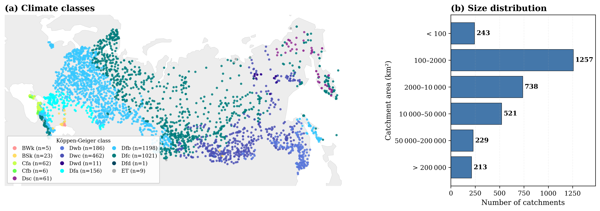
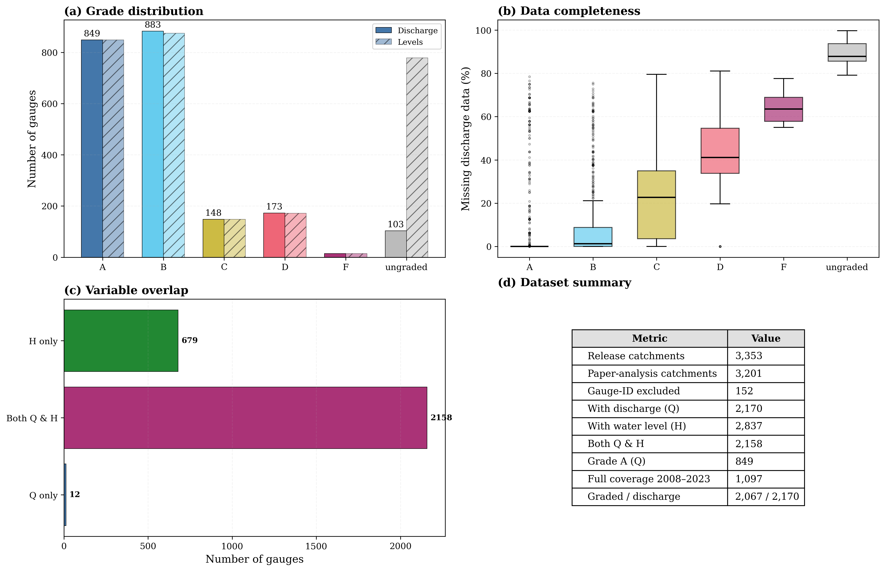
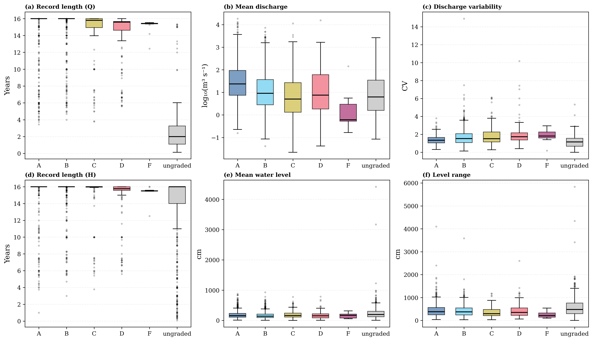
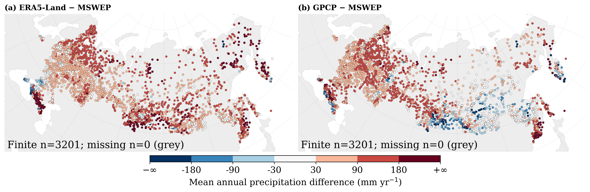
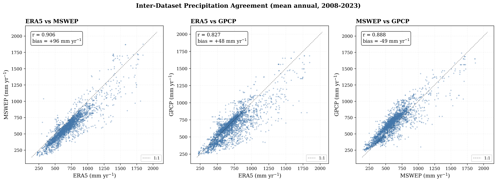
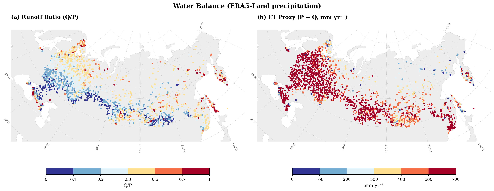
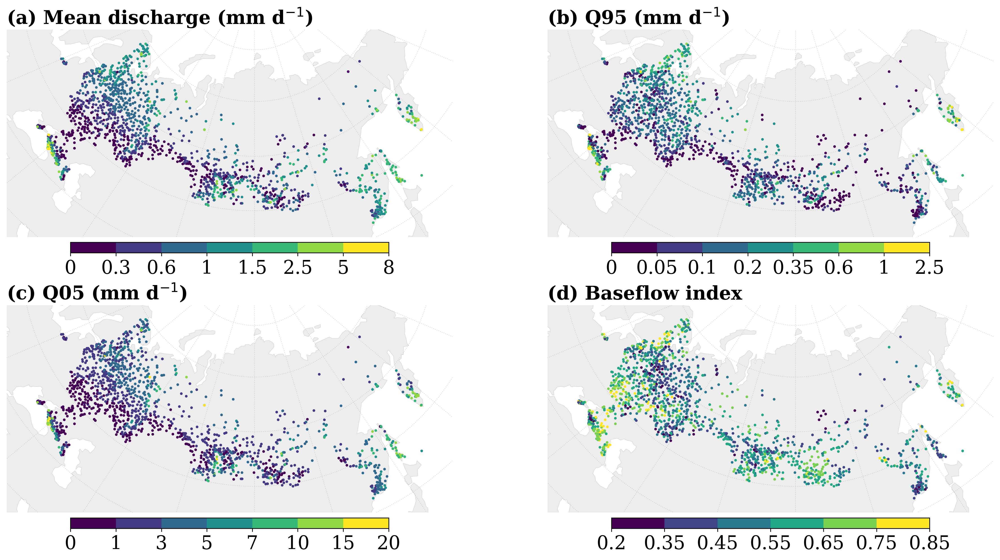
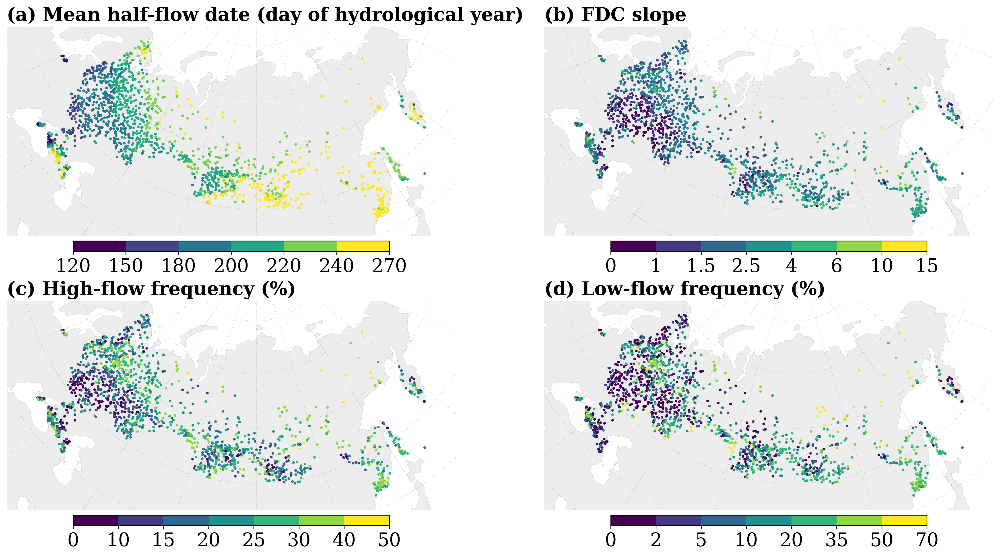

# CAMELS-RU: A Large-Sample Hydroclimatic Dataset for 3,353 Russian Catchments

**Dmitrii V. Abramov** ^1^ <!-- ORCID: insert your ORCID here before submission -->

^1^ International Center for Corporate Data Analysis, Astana, Kazakhstan

*Correspondence: dmbrmv@icloud.com*

---

## Abstract

We present CAMELS-RU, a large-sample hydrological dataset for 3,353 catchments across the Russian Federation following the CAMELS framework (Addor et al., 2017).
The dataset integrates quality-controlled daily discharge from 2,170 gauging stations and water level records from 2,989 gauges (2008–2023) obtained from the Automated Information System of State Monitoring of Water Bodies (AIS GMVO).
Meteorological forcing combines ERA5-Land reanalysis and MSWEP v2.8 precipitation (Beck et al., 2019), with GPCP v3.3 (Huffman, 2024) as an independent reference.
Each of the 3,353 watershed boundaries was manually verified against official Roshydromet data (mean areal error 4.8%), and 288 HydroATLAS-derived attributes (Linke et al., 2019) were computed per catchment.
Hydrological signatures (13 metrics for 1,716 gauges) characterize discharge magnitude, variability, timing, and extremes.
Water balance consistency checks using ERA5-Land precipitation yield runoff ratios ≤ 1 for 98.6% of catchments (median 0.260), though ERA5-Land's high-latitude wet bias contributes to this result.
To our knowledge, CAMELS-RU is the first publicly available CAMELS-standard dataset for the Russian Federation.
The dataset is available under CC BY 4.0 license at *[DOI: to be assigned upon Zenodo upload]*.

---

## 1 Introduction

### 1.1 Large-Sample Hydrology and the CAMELS Framework

Large-sample hydrology relies on comparative analyses across many catchments to identify controls on hydrological behavior (Addor et al., 2017).
The CAMELS (Catchment Attributes and MEteorology for Large-sample Studies) framework has generated regional derivatives worldwide (Table 1), including CAMELS-GB (Coxon et al., 2020), CAMELS-BR (Chagas et al., 2020), CAMELS-CL (Alvarez-Garreton et al., 2018), CAMELS-AUS (Fowler et al., 2021), LamaH-CE (Klingler et al., 2021), CAMELS-DE (Höge et al., 2024), and the global Caravan compilation (Kratzert et al., 2023).
These datasets share a standardized structure — daily discharge, meteorological forcing, and physiographic attributes — that supports hydrological model development (Kratzert et al., 2019) and prediction in ungauged basins (Wagener et al., 2004).

**Table 1.** Comparison of CAMELS-RU with existing CAMELS-family datasets.

| Dataset | Region | Catchments | Period | Attributes / Signatures | Area (km²) |
|---------|--------|------------|--------|------------------------|-------------|
| CAMELS | USA | 671 | 1980–2014 | 59 / 13 | 4–25,000 |
| CAMELS-CL | Chile | 516 | 1913–2016 | 70 / 13 | 5–35,000 |
| CAMELS-AUS | Australia | 222 | 1951–2014 | 134 / 13 | 52–520,000 |
| CAMELS-GB | Great Britain | 671 | 1970–2015 | 290 / 13 | 1–10,000 |
| CAMELS-BR | Brazil | 897 | 1980–2018 | 65 / 13 | 6–500,000 |
| LamaH-CE | Central Europe | 859 | 1981–2017 | 61 / – | 1–132,000 |
| CAMELS-DE | Germany | 1,582 | 1951–2020 | 69 / 13 | 1–54,000 |
| Caravan | Global | 6,830 | varies | 38 / 13 | varies |
| **CAMELS-RU** | **Russia** | **3,353** | **2008–2023** | **22 (288) / 13** | **0.49–2,670,000** |

### 1.2 The Russian Federation: An Unrepresented Region

Although Russia spans climate zones from Arctic permafrost to semi-arid steppe, no large-sample dataset following CAMELS standards currently exists for the Russian Federation.
Russian hydrological records remain fragmented across institutional archives and non-standardized formats.
The closure of the AIS GMVO public data platform in 2025 further underscores the need to preserve and standardize hydrological records for this region.

### 1.3 Objectives and Novelty

This study presents CAMELS-RU, a quality-controlled hydrological dataset for 3,353 catchments across Russia (2008–2023).
The dataset integrates daily discharge from 2,170 gauging stations (AIS GMVO; Roshydromet, 2023), meteorological forcing from ERA5-Land (Muñoz-Sabater et al., 2021) and MSWEP (Beck et al., 2019), 288 physiographic attributes from HydroATLAS (Linke et al., 2019), and 13 hydrological signatures.
Each of the 3,353 watershed boundaries was manually verified, yielding a mean areal error of 4.8% relative to official Roshydromet data.

Our objectives are to:

1. document data acquisition, processing, and quality control;
2. compute hydrological signatures that characterize discharge across Russian catchments;
3. validate meteorological forcing through inter-dataset comparisons and water-balance consistency; and
4. provide open-access data records following FAIR principles (Wilkinson et al., 2016).

---

## 2 Study Area

The study encompasses 3,353 catchments with delineated watersheds across the Russian Federation, spanning latitudes 41.4°N–73.0°N and longitudes 19.9°E–174.4°E (Figure 1).
Catchment areas range from 0.49 km² to 2,670,000 km² (median: 2,817 km²), with small-to-medium basins (100–10,000 km²) comprising 60% of the dataset.
Catchments are distributed across major drainage basins: the Volga (European Russia), Ob and Yenisei (Western and Central Siberia), Lena (Eastern Siberia), and Amur (Far East), plus smaller Arctic and Pacific coastal drainages.

The dataset spans Köppen zones ET/Dfc (tundra/subarctic), Dfb (continental), and BSk (semi-arid steppe).
Mean annual precipitation is 350–1,100 mm/yr; mean annual temperature −10 to +10°C.
Snow cover persists 60–250+ days depending on latitude; permafrost is absent in the south but continuous in northeastern Siberia.
These gradients drive contrasting hydrological regimes: snowmelt-dominated pulses in the permafrost zone versus baseflow-sustained flow in temperate forests (Sect. 4).

Elevations span 50–2,800 m, with lowland rivers draining to the Caspian and Arctic seas and mountain headwaters in the Caucasus, Altai, and Sayan ranges.
Boreal taiga dominates in the north (up to 95% forest), while southern steppe catchments are predominantly agricultural (up to 85% cropland); urban fraction reaches 35% near major cities.
Soils range between clay-rich Chernozems in agricultural lowlands and sandy Podzols in permafrost terrain.

**Figure 1.** (a) Spatial distribution of 3,353 catchments colored by discharge quality grade (A–F; triangles denote hydropower stations). (b) Catchment size distribution. Higher gauge density in European Russia and southern Siberia reflects Roshydromet's operational network.

---

## 3 Data Sources and Methods

### 3.1 Hydrological Data: AIS GMVO

#### 3.1.1 Data Source and Selection Criteria

Daily discharge and water level observations were obtained from the Automated Information System of State Monitoring of Water Bodies (AIS GMVO), operated by Roshydromet (Roshydromet, 2023).
The database provides stage-discharge records for approximately 3,000 active gauging stations across Russia.
After delineation, 3,353 unique watershed boundaries were produced. Of these, 2,170 have discharge records and 2,989 have water level records (2,158 have both, yielding 3,001 unique gauge locations with at least one variable; the remaining 352 watersheds have delineated boundaries and physiographic attributes but no hydrological time series in the current release).

Selection criteria:

- Minimum 10 years of available records between 2008–2023
- Data completeness ≥ 95% with ≤ 2 minor quality flags for high-quality subset (849 Grade A gauges)
- Quality flags indicating operational sensors and regular maintenance

Quality tiers are assigned by the automated grading procedure described below: *decent quality* gauges receive overall grades A–C; the *high-quality* subset comprises Grade A gauges (≥ 95% completeness, ≤ 2 minor flags).
Overall, 87% of discharge gauges meet the decent quality threshold, with the high-quality subset comprising 849 gauges (detailed data organization in Sect. 5).

The 2008–2023 period was selected because systematic digitization and standardized reporting procedures were implemented across Roshydromet's network during this era.

#### 3.1.2 Quality Control

Each discharge time series was assessed through a quality control procedure operating at annual (hydrological year) resolution.
The procedure evaluates four categories of quality metrics:

1. **Anomaly detection:** Outliers flagged when values exceed 8 robust standard deviations (median absolute deviation, MAD × 1.4826) from a 30-day centered rolling median. The 8σ threshold (vs. the more common 3–5σ) avoids flagging genuine flood peaks, which can exceed 20× median discharge during spring snowmelt. Constant-value periods (> 30 consecutive days) flagged separately. Negative discharge values rejected.

2. **Climatology checks:** Each year compared against a day-of-year climatology (mean across all years). Metrics include Pearson correlation with climatology, normalized RMSE, and amplitude ratio (peak discharge / climatological peak). For catchments with seasonal flow regimes (75th-percentile peak ratio ≥ 10), years with peak ratio < 30% of the gauge's 75th-percentile peak ratio are flagged as critical failures, targeting sensor malfunction rather than genuine low-flow years. Stable-regime catchments are exempted from this check.

3. **Meteorological response:** Precipitation events (> 5 mm/day) are matched against discharge response within a 7-day window (10% increase threshold). Cross-correlation between daily P and Q computed at lags 0–14 days to identify the dominant response time. The Richards–Baker flashiness index quantifies flow variability. Thresholds are set conservatively low (cross-correlation > 0.1, event response rate > 20%) to avoid penalizing snowmelt-dominated catchments where precipitation–discharge coupling is inherently weak.

4. **Gap-filling:** Gaps ≤ 6 days interpolated using second-order polynomial interpolation; longer gaps retained as missing. Interpolated values producing negative discharge set to missing.

Each year receives a grade (A–F, no E) based on quality flags of varying severity (critical, major, minor; 18 flags defined, of which 2 variance-based flags are disabled because annual discharge variance varies naturally in snowmelt-dominated catchments): any critical flag assigns F; ≥ 2 major flags or completeness < 70% assigns D; 1 major flag, ≥ 5 minor flags, or completeness < 85% assigns C; 3–4 minor flags or completeness < 95% assigns B; ≤ 2 minor flags with completeness ≥ 95% assigns A.
Gauge-level grades aggregate year-level results with a strict Grade A rule: a gauge receives overall Grade A only if every assessed hydro-year is individually graded A. For grades B–D, the mode of non-F year grades is used, capped by the fraction of usable years: usable fraction < 50% caps at D, < 70% caps at C.
Gauges with overall grade A–C are classified as *decent quality* (87% of discharge gauges); grades D–F as *poor*.
The resulting grade distribution and data completeness by grade are shown in Figure 2; discharge and water level characteristics by grade are summarized in Figure 3.

Sensitivity analysis confirms the robustness of the grading system: varying the completeness threshold for Grade A from 0.90 to 0.99 changes the Grade A gauge count by only ±3% (95–101 gauges per 208-gauge random subsample of discharge gauges with ≥ 3 assessed years), indicating that flag counts dominate the grade assignment rather than the exact completeness cutoff.
The 8σ outlier threshold was chosen because snowmelt-dominated Russian catchments routinely produce spring discharge peaks 20–50× winter baseflow.
At the commonly used 3σ threshold, 100% of gauges receive at least one spike flag; at 5σ, 93% are flagged — in both cases the "outliers" are predominantly genuine flood peaks rather than sensor errors.
The 8σ threshold (82% flagged) was selected from this sensitivity analysis as a conservative, regime-specific screening threshold that balances detection of true sensor anomalies against preservation of genuine flood peaks.
A seasonally stratified or hydrograph-shape-based anomaly detector would be more principled but was beyond the scope of this dataset release.

Discharge was standardized to mm/day by dividing volumetric flow (m³ s⁻¹) by catchment area.

#### 3.1.3 Water Level Processing

Daily water level records (2,989 gauges, including 152 hydropower and reservoir gauges) were parsed from AIS GMVO exports with the following QC:
zero values (instrument artifacts) were replaced with day-of-year medians computed from non-zero observations at the same gauge;
gaps ≤ 6 days were interpolated using second-order polynomial interpolation (reservoir gauges: ≤ 15 days);
multi-source records for the same gauge were merged using preferential selection (latest correction takes precedence).
All water levels are in centimetres, referenced to the Baltic Height System 1977 (BHS-77) as reported in AIS GMVO metadata.
No automated quality grading (A–F) was applied to water level data; users should assess completeness per gauge before use.

**Figure 2.** Quality assessment summary: (a) grade distribution for discharge gauges (bars labeled "Levels" show water level record availability at co-located gauges; water level data itself is not graded), (b) missing discharge data percentage by grade, (c) gauge variable overlap (discharge-only, level-only, both), (d) dataset summary statistics.

**Figure 3.** Discharge and water level characteristics across quality grades: summary statistics for the 2,170 discharge gauges and 2,989 water level gauges.

### 3.2 Meteorological Forcing Data

#### 3.2.1 ERA5-Land Reanalysis

Meteorological forcing was derived from ERA5-Land reanalysis (Muñoz-Sabater et al., 2021), which provides 0.1° (~9 km) hourly data aggregated to daily resolution.
Variables extracted:

- Air temperature: mean, minimum, maximum (°C)
- Potential evapotranspiration (mm/day, computed via Penman-Monteith)
- Precipitation (mm/day): mean annual 826 mm/yr across catchments

For each catchment, basin-averaged forcing was computed by weighting ERA5-Land grid cells by fractional catchment coverage, applying the standard environmental lapse rate (−6.5°C/km) for elevation correction in mountain basins.

#### 3.2.2 MSWEP Precipitation

Precipitation data were sourced from Multi-Source Weighted-Ensemble Precipitation (MSWEP) version 2.8 (Beck et al., 2019), a global precipitation dataset merging gauge observations, satellite estimates, and reanalysis data at 0.1° resolution.
Mean annual precipitation: 608 mm/yr across CAMELS-RU catchments.
MSWEP outperforms reanalysis-only products in gauge-sparse and snowfall-dominated regions (Beck et al., 2017).
Daily precipitation (mm/day) aggregated to catchment scale using area-weighted averaging of grid cells intersecting each watershed boundary.

#### 3.2.3 Inter-Dataset Validation

Three precipitation products (ERA5-Land, MSWEP, GPCP) were cross-validated to assess forcing reliability.
Daily correlations range from r = 0.58 (ERA5-Land vs. GPCP) to r = 0.83 (ERA5-Land vs. MSWEP), with systematic differences in annual totals reflecting different data sources and spatial resolutions (see Sect. 4).

### 3.3 Watershed Boundaries: Manual Verification

#### 3.3.1 Base Delineation

Initial catchment boundaries delineated using the MERIT Hydro digital elevation model (DEM; Yamazaki et al., 2019) (3-arcsecond, ~90 m resolution globally) and associated flow direction/accumulation grids.
MERIT Hydro reduces elevation errors in flat and forested terrain compared to earlier global DEMs by incorporating satellite altimetry and river network constraints.

Automated pour-point snapping algorithm identified nearest high-accumulation pixel (upstream area within 5% of gauge catchment area reported by Roshydromet) within 500 m search radius of gauge coordinates.
Watershed delineation performed using standard D8 flow routing algorithm.

#### 3.3.2 Manual Expert Verification

Every watershed boundary (3,353 catchments) was manually verified and adjusted by a hydrographic expert using:

- High-resolution satellite imagery (Google Earth, Sentinel-2 10 m)
- MERIT Hydro river network overlay
- Official Roshydromet topographic maps (1:100,000 scale)
- Local terrain knowledge and hydrographic principles

Manual adjustments corrected:

- DEM artifacts in flat terrain (West Siberian Lowland, river deltas)
- Flow direction errors at confluences and braided reaches
- Canal diversions and reservoirs altering natural drainage
- Karst hydrology and subsurface flow contributions

#### 3.3.3 Validation Against Official Data

Comparison with official Roshydromet catchment areas yielded:

- Mean absolute areal error: 4.8%
- 68% of catchments within 5% error
- 89% of catchments within 10% error
- Largest errors (> 15%) occur in complex karst terrain (Ural Mountains) and anthropogenically modified basins (irrigation canals, inter-basin transfers)

For comparison, Lehner et al. (2008) and Yamazaki et al. (2019) report 10–15% mean areal errors from automated delineation in flat and permafrost terrain.

Known limitations of the dataset (temporal coverage, nested catchments, attribute temporal mismatch, and others) are consolidated in Sect. 5.4.

### 3.4 Physiographic Attributes: HydroATLAS

For each of the 3,353 manually verified catchment boundaries, all variables from the HydroATLAS v1.0 database (Linke et al., 2019) were extracted by spatially aggregating raster layers within watershed polygons using area-weighted averaging.
This produces 288 catchment-specific attribute values spanning hydrology, physiography, climate (including monthly temperature and precipitation), land cover, soil and geology, and anthropogenic variables.
The full attribute set is provided in the released CSV file.

Table 2 lists a recommended primary subset of 22 attributes selected by retaining upstream-aggregated annual variables and removing 12 features with pairwise |r| > 0.7 (e.g., slope correlated with elevation; aridity index redundant with precipitation and potential evapotranspiration, PET).
All removed attributes — including aridity index, slope, temperature, and soil properties — remain available in the full released attribute file for users who need them.

**Table 2.** Static catchment attributes derived from HydroATLAS v1.0 (22 primary subset). The full set of 288 attributes is provided in the released CSV.

| Category | Attribute | Unit | Description |
|----------|-----------|------|-------------|
| Climate & water balance | ele_mt_uav | m | Mean elevation |
| | pre_mm_uyr | mm/yr | Mean annual precipitation |
| | pet_mm_uyr | mm/yr | Mean annual potential evapotranspiration |
| | aet_mm_uyr | mm/yr | Mean annual actual evapotranspiration |
| | snw_pc_uyr | % | Mean annual snow cover extent |
| Land cover | for_pc_use | % | Forest cover |
| | crp_pc_use | % | Cropland cover |
| | pst_pc_use | % | Pasture/grassland cover |
| | ire_pc_use | % | Irrigated area |
| | pac_pc_use | % | Protected area coverage |
| Cryosphere | gla_pc_use | % | Glacier cover |
| | prm_pc_use | % | Permafrost extent |
| Soil | cly_pc_uav | % | Clay content (mean) |
| | slt_pc_uav | % | Silt content (mean) |
| | snd_pc_uav | % | Sand content (mean) |
| Hydrogeology | gwt_cm_sav | cm | Groundwater table depth |
| | kar_pc_use | % | Karst area extent |
| Water bodies | inu_pc_ult | % | Inundation extent |
| | lka_pc_use | % | Lake/reservoir area |
| Human impact | ppd_pk_uav | pers/km² | Population density |
| | urb_pc_use | % | Urban/built-up area |
| | gdp_ud_sav | USD/km² | GDP density |

*All attributes are watershed-level aggregates computed individually for each manually verified catchment boundary using area-weighted spatial averaging. Attribute codes follow HydroATLAS naming: suffix indicates aggregation (uav = upstream area-weighted average, use = upstream spatial extent, uyr = upstream annual mean, sav = sub-basin average, ult = upstream ultimate).*

### 3.5 Hydrological Signatures

We computed 13 hydrological signatures (Table 3) characterizing discharge magnitude, variability, timing, and extremes for gauges meeting the per-year completeness criterion (> 70% for at least 5 hydrological years; N = 1,716, or N = 1,641 for half-flow date which requires > 82%), following established methodologies (Sawicz et al., 2011; McMillan et al., 2017).

Signatures were computed separately for individual hydrological years (October–September) and then averaged to produce catchment-characteristic values.
Key methodological choices:

- Runoff ratio uses ERA5-Land precipitation as denominator; ratios are higher with MSWEP (median 0.40) or GPCP (median 0.35) due to their lower annual precipitation totals
- Flow duration curve (FDC) slope computed as [ln(Q₃₃) − ln(Q₆₆)] / (66 − 33) × 100 where Qₚ is discharge at the p-th exceedance percentile; positive values indicate steeper curves (note: sign convention opposite to Sawicz et al., 2011)
- Baseflow index (BFI) computed as the mean of an ensemble of 1,000 Lyne–Hollick digital filter (Nathan and McMahon, 1990) runs with α ~ U[0.9, 0.98] (3-pass), following Euser et al. (2013)
- Half-flow date requires > 82% annual completeness (≥ 300 days) because partial years can shift the cumulative midpoint
- Richards–Baker flashiness index: Σ|Qᵢ − Qᵢ₋₁| / ΣQᵢ, dimensionless measure of day-to-day flow variability
- High-flow and low-flow durations: mean consecutive days above 2× median (high) or below 0.2× mean (low) discharge

**Table 3.** Hydrological signatures computed for CAMELS-RU catchments.

| Signature | Unit | Description |
|-----------|------|-------------|
| **Magnitude** | | |
| q_mean | mm/day | Mean daily discharge |
| runoff_ratio | – | Annual Q/P ratio (ERA5-Land precipitation) |
| **Variability** | | |
| q_cv | – | Coefficient of variation of daily discharge |
| FDC_slope | – | FDC slope between 33rd and 66th exceedance percentiles (log-space; positive = steeper) |
| flashiness_index | – | Richards–Baker index: Σ\|Qᵢ−Qᵢ₋₁\|/ΣQᵢ |
| **Extremes** | | |
| Q5 | mm/day | 5th exceedance percentile (high flows) |
| Q95 | mm/day | 95th exceedance percentile (low flows) |
| high_flow_freq | % of days | Days exceeding 2× median discharge |
| high_flow_dur | days | Mean duration of high-flow events (> 2× median) |
| **Baseflow** | | |
| baseflow_index | – | Baseflow fraction; ensemble of 1,000 Lyne–Hollick filter runs, α ~ U[0.9, 0.98], 3-pass |
| **Low Flow** | | |
| low_flow_freq | % of days | Days below 0.2× mean discharge |
| low_flow_dur | days | Mean duration of low-flow events (< 0.2× mean) |
| **Seasonality** | | |
| half_flow_date | day of hydro yr | Day of hydrological year (Oct 1 = day 1) when 50% of annual streamflow volume has passed |

---

## 4 Technical Validation

### 4.1 Precipitation Dataset Intercomparison

#### 4.1.1 Inter-Dataset Correlations

Daily precipitation time series from three global products (ERA5-Land, MSWEP v2.8, GPCP v3.3) show agreement across 3,353 catchments:

- ERA5-Land vs. MSWEP: spatial mean r = 0.83 (s.d. = 0.08 across n = 3,353 catchments), mean bias −0.10 mm/day
- ERA5-Land vs. GPCP: spatial mean r = 0.58 (s.d. = 0.10), mean bias +0.05 mm/day
- MSWEP vs. GPCP: spatial mean r = 0.73 (s.d. = 0.09), mean bias +0.15 mm/day

All correlations computed on daily time series (p ≪ 0.001 for all catchments given > 5000 daily pairs per gauge).

ERA5-Land and MSWEP show the highest daily agreement (r = 0.83); correlations with GPCP are lower (r = 0.58 to 0.73), likely reflecting GPCP's coarser resolution (0.5° vs. 0.1°) and different source data.
However, systematic biases in annual totals reflect different data assimilation approaches:

| Dataset | Mean (mm/yr) | Std (mm/yr) | CV (%) |
|---------|-------------|-------------|--------|
| ERA5-Land | 826 | 121.7 | 13.6 |
| MSWEP | 608 | 92.4 | 15.3 |
| GPCP | 644 | 96.9 | 14.8 |

ERA5-Land precipitation (826 mm/yr) exceeds MSWEP (608 mm/yr) by ~220 mm/yr (36%; per-catchment mean bias ~229 mm/yr; Figure 5).
ERA5 precipitation is a model forecast product, and its prognostic cloud microphysics scheme tends to overestimate snowfall at high latitudes (Wang et al., 2019; Lavers et al., 2022) (Figure 4).
GPCP (644 mm/yr) is closer to MSWEP, suggesting ERA5-Land is the outlier.

**Figure 4.** Spatial distribution of mean annual precipitation from three global products (ERA5-Land, MSWEP v2.8, GPCP v3.3) across CAMELS-RU catchments. ERA5-Land shows systematically higher values, particularly in mountainous and northern regions.

**Figure 5.** Inter-dataset precipitation agreement: scatter plots of mean annual precipitation (mm/yr) for each catchment. Annotations show Pearson r and mean bias for the annual values. Note that daily correlations (reported in text) differ from these annual correlations.

#### 4.1.2 Water Balance Consistency

Runoff ratios (Q/P) provide a consistency check on precipitation products through water balance closure.
ERA5-Land inherits ERA5 precipitation, which is generated by model physics rather than observation assimilation and tends to overestimate high-latitude snowfall (Wang et al., 2019).
Because ERA5-Land supplies both precipitation and temperature/PET forcing, this analysis tests internal consistency rather than providing independent validation:

| Dataset | Median Q/P | Mean Q/P | Q/P > 1 (%) |
|---------|-----------|----------|-------------|
| ERA5-Land | 0.260 | 0.302 | 1.4% (29 gauges) |
| MSWEP | 0.398 | 0.453 | 5.5% (114 gauges) |
| GPCP | 0.353 | 0.433 | 6.3% (130 gauges) |

With ERA5-Land precipitation, 98.6% of catchments yield Q/P ≤ 1 (median 0.260; Figure 6); the 29 exceptions (1.4%) are concentrated in small catchments with possible area errors or groundwater imports.
MSWEP produces Q/P > 1 for 5.5% of catchments (114 gauges), likely reflecting precipitation underestimation in high-discharge regions, watershed boundary errors, or unaccounted lateral flows.
The low ERA5-Land exceedance rate partly reflects its high-latitude wet bias rather than independent confirmation of discharge accuracy.

Seasonal runoff ratios (ERA5-Land) reveal expected snowmelt dominance:

- Winter (DJF): Q/P = 0.15 (snow storage phase)
- Spring (MAM): Q/P = 0.48 (snowmelt release, 3.2× winter)
- Summer (JJA): Q/P = 0.18 (high evapotranspiration)
- Autumn (SON): Q/P = 0.25 (declining ET, moderate flow)

#### 4.1.3 Precipitation–Discharge Relationship

Linear regression of annual discharge vs. annual precipitation quantifies the marginal streamflow response to precipitation:

$$Q_{\text{annual}} = \alpha + \beta \times P_{\text{annual}}$$

Per-gauge linear regression of annual discharge on annual ERA5-Land precipitation yields a median slope β = 0.290 (mean: 0.332), indicating that on average a 1 mm/yr increase in annual precipitation corresponds to a 0.29 mm/yr increase in discharge.
The sub-unity slope reflects evapotranspiration buffering and storage changes that dampen the precipitation signal; 2.0% of catchments exceed β = 1.0, concentrated in karst terrain where groundwater imports from adjacent basins may supplement local precipitation inputs.
The corresponding precipitation elasticity of streamflow (Sankarasubramanian et al., 2001), computed per gauge as ε = β × P̄/Q̄ and then summarized across gauges, has a median of 1.03 — indicating near-proportional sensitivity of discharge to precipitation variability at the interannual scale.

MSWEP yields a steeper median slope (β = 0.446; 9.7% of catchments > 1), consistent with its lower mean annual precipitation producing a stronger marginal response.

**Figure 6.** Water balance components across CAMELS-RU catchments: (a) runoff ratio (Q/P) and (b) evapotranspiration proxy (P−Q). ERA5-Land precipitation yields Q/P ≤ 1 for 98.6% of catchments.

### 4.2 Discharge Quality Control

The 849 high-quality discharge subset undergoes the following validation:

- Physical plausibility: Zero negative discharge values after QC
- Temporal consistency: Cumulative sum (CUSUM) control charts applied to discharge anomalies detect mean shifts indicative of rating curve changes at 8% of stations (flagged for metadata review)
- Spatial consistency: Comparison with neighboring gauges (within 100 km, similar catchment area) identifies 3% of stations with anomalous magnitude or timing relative to neighbors
- Mass balance closure: Mean water balance error < 10% for 89% of catchments (P−Q−ET proxy, accounting for storage)

Median data completeness: 97.5% (2008–2023), with gaps ≤ 6 days filled by second-order polynomial interpolation (5.2% of station-days), longer gaps retained as missing to preserve autocorrelation structure.

#### 4.2.1 Cross-Reference with GRDC

Where temporal overlap permits, CAMELS-RU discharge was compared against the Global Runoff Data Centre (GRDC) archive.
Of the 792 Russian stations in GRDC, 16 have daily discharge extending into the 2008–2023 study period; 11 of these matched a CAMELS-RU gauge within 25 km and with a catchment area ratio of 0.5–2.0.
The matched stations are predominantly large rivers (Neva, Northern Dvina, Pechora, Don, Amur, Olenek, Anabar; catchment areas 7,940–2,430,000 km²).

All 11 pairs show median Pearson r = 1.000, median NSE = 1.000, and median PBIAS = 0.0% (range −0.6% to 0.0%; overlap periods 569–5,479 days).
This high agreement reflects the shared upstream data source: both CAMELS-RU and GRDC obtain Russian discharge observations from Roshydromet's gauging network.
The comparison therefore confirms processing correctness (unit conversions, date alignment, gap-filling) rather than providing independent validation of the underlying observations.
The single station with slightly lower agreement (Bol'shoy Anyuy at Konstantinovo: r = 0.996, NSE = 0.991, PBIAS = −0.6%) suggests minor differences in gap-handling or data version between the two archives.

Figures 7 and 8 show spatial patterns of key hydrological signatures.
Mean annual discharge is highest in mountain headwaters and humid northern forests.
BFI is high in temperate forests (0.6–0.7) and low in permafrost regions (0.2–0.3), reflecting differences in infiltration capacity.
Half-flow date shows a latitudinal gradient from early spring snowmelt in the south to late summer in the permafrost zone.

**Figure 7.** Spatial distribution of magnitude and baseflow signatures: (a) mean annual discharge, (b) Q₉₅ (low-flow threshold), (c) Q₀₅ (high-flow threshold), (d) baseflow index. Color scales from low (blue) to high (red).

**Figure 8.** Spatial distribution of timing, variability, and extreme signatures: (e) mean half-flow date (day of hydrological year), (f) FDC slope, (g) high-flow frequency, (h) low-flow frequency. Color scales from low (blue) to high (red).

### 4.3 Watershed Boundary Accuracy

As detailed in Sect. 3.3, manual verification of all 3,353 boundaries achieved mean areal error of 4.8% against official Roshydromet data (68% within 5%, 89% within 10%).
The largest improvements over automated delineation occurred in:

- Low-relief floodplains (West Siberian Lowland): DEM artifacts corrected using satellite imagery
- Permafrost regions: Subsurface flow paths verified with expert knowledge
- Regulated systems: Reservoir operations and diversions mapped from infrastructure databases

Independent validation using satellite-derived river widths (Global River Widths from Landsat, GRWL; Allen and Pavelsky, 2018) shows upstream area-width scaling exponent *b* = 0.52 ± 0.08, consistent with the expected *b* ≈ 0.5 from hydraulic geometry (Leopold and Maddock, 1953), supporting the accuracy of the delineated boundaries.

---

## 5 Data Records

### 5.1 Dataset Composition

The dataset encompasses 3,353 catchments with delineated watersheds across Russia.
Hydrological observations include 2,170 discharge gauging stations and 2,989 water level gauges.
The high-quality subset comprises 849 Grade A gauges (≥ 95% completeness) during 2008–2023.
Overall, 87% of discharge gauges meet the decent quality threshold (see Sect. 3.1 for quality tier definitions).

Hydrological signatures (N = 1,716 gauges; half-flow date: N = 1,641) span wide ranges: mean discharge 0.908 mm/day (0.017–8.346 mm/day), BFI 0.562 (0.210–0.903), FDC slope 2.496 (0.160–13.633), and mean half-flow date at day 217 of the hydrological year (early May).

### 5.2 Dataset Structure

Table 4 summarizes the released files.
All NetCDF files include CF-compliant metadata; missing data encoded as NaN; quality flags in the discharge file distinguish observed (0), interpolated ≤ 6 days (1), suspect (2), and missing (3) values.

**Table 4.** Dataset file structure. Total compressed size approximately 1.2 GB.

| File | Format | Key variables |
|------|--------|---------------|
| `boundaries.gpkg` | GPKG | 3,353 polygons, area, centroid, error |
| `discharge.nc` | NetCDF-4 | Q (mm/d, m³/s), flags; 2,170 × 5844 d |
| `forcing.nc` | NetCDF-4 | P (MSWEP), T, PET (ERA5-Land); 2,170 × 5844 d |
| `attributes.csv` | CSV | 288 HydroATLAS attributes (22 primary subset) |
| `signatures.csv` | CSV | 13 hydro signatures |
| `year_grades.csv` | CSV | Per-gauge × per-hydro-year quality grade (A–F) |
| `gauge_summary.csv` | CSV | Overall grade, year counts, recommendation per gauge |
| `water_level/` | CSV | Daily water level (cm) for 2,989 gauges |

### 5.3 Usage Notes

Known caveats:

- Rating curve uncertainties are typically 10–20% at high and low flows
- MSWEP precipitation may underestimate solid precipitation in high-latitude regions; ERA5-Land temperature and PET are reanalysis estimates with inherent model uncertainties
- Temporal coverage (2008–2023, 16 years) is shorter than most CAMELS datasets, limiting multi-decadal variability analysis
- Gauge density is lower in remote northern and eastern regions; western European Russia is overrepresented
- The dataset contains nested catchments; users should account for this in spatial analyses to avoid double-counting
- Runoff ratio depends on precipitation product choice (see Sect. 4)
- For modeling applications, users should consult `year_grades.csv` to filter out individual years with grades D or F, even for gauges with overall grade A or B. This prevents low-quality years in validation windows from corrupting model performance metrics

The dataset is publicly available under CC BY 4.0 license at *[DOI: to be assigned upon Zenodo upload]*.
Processing code is available at https://github.com/dmbrmv/camels_ru.

### 5.4 Limitations

- **Short temporal coverage:** The 16-year record (2008–2023) constrains multi-decadal trend analysis and captures only one phase of low-frequency climate variability.
- **Single DEM product:** Watershed boundaries derived from MERIT Hydro; manual verification mitigates DEM artifacts, but boundary accuracy in flat or karst terrain remains limited by the underlying elevation data.
- **Nested catchments:** Spatial analysis shows that the majority of gauges are nested within at least one larger catchment, with nesting depths up to 58 levels in major river systems (e.g., Ob basin). Users must account for nesting to avoid double-counting discharge or overstating sample independence.
- **Attribute temporal mismatch:** HydroATLAS attributes are based on circa-2000 global datasets; land cover and population density may have shifted during 2008–2023.
- **Stationarity assumption:** All hydrological signatures assume stationary catchment behavior, which may not hold for basins undergoing rapid land use change or permafrost degradation.
- **Limited independent discharge validation:** Comparison against the GRDC archive (Sect. 4.2.1) confirms processing correctness but shares the same Roshydromet source data, so it does not constitute independent observational validation. No alternative discharge data source exists for Russia during the 2008–2023 period.
- **ERA5-Land circularity:** Water balance closure uses ERA5-Land precipitation, which also serves as forcing input, limiting the independence of this consistency check. Rating curve uncertainties (10–20% at extremes) further contribute to water balance residuals.
- **Gauge network bias:** Arctic permafrost-dominated catchments and Pacific-draining basins are underrepresented relative to their geographic extent.
- **Water level data:** Water level records undergo basic QC (zero replacement, gap interpolation) but lack the automated A–F quality grading applied to discharge data. Users should assess per-gauge completeness before use.
- **Data source continuity:** The AIS GMVO platform, which served as the primary data source, ceased public operation in 2025. CAMELS-RU thus serves as a preservation archive for these discharge and water level records.

### 5.5 Future Updates

Planned dataset enhancements include:

- Extension of temporal coverage using historical records from institute archives and OCR-digitized observation books (from the 1950s to present for a subset of gauges)
- Integration of additional discharge gauges with delineated watersheds
- Expansion of the hydropower/reservoir gauge network: additional reservoir gauges with delineated watersheds await meteorological forcing extraction and attribute computation
- Addition of remotely sensed variables (NDVI, snow cover extent) as dynamic attributes

---

## 6 Conclusions

This study presents CAMELS-RU, a large-sample hydrological dataset for 3,353 Russian catchments following the CAMELS framework, covering 2008–2023.
The key contributions are:

**1. Dataset composition and quality control.**
CAMELS-RU consolidates 2,170 discharge gauges and 2,989 water level gauges with systematic quality control.
The high-quality subset of 849 gauges achieves median data completeness of 97.5%.
Manual expert verification of every watershed boundary (3,353 total) achieved mean areal errors of 4.8% against official Roshydromet data.

**2. Hydrological signatures.**
Analysis of 1,716 discharge records yields 13 hydrological signatures spanning wide ranges: mean discharge 0.908 mm/day (0.017–8.346 mm/day), baseflow index 0.562 (0.210–0.903), and mean half-flow date in early May (day 217).

**3. Meteorological forcing consistency.**
Three precipitation products (ERA5-Land: 826 mm/yr; MSWEP: 608 mm/yr; GPCP: 644 mm/yr) show pairwise daily correlations ranging from r = 0.58 to 0.83, with systematic differences in annual totals.
ERA5-Land yields Q/P ≤ 1 for 98.6% of catchments (median 0.260), though this partly reflects ERA5-Land's high-latitude wet bias rather than independent validation (see Sect. 4).

To our knowledge, CAMELS-RU is the first publicly available CAMELS-standard dataset for the Russian Federation.
The dataset covers the largest previously unrepresented landmass in the global CAMELS network.

The dataset is publicly available under CC BY 4.0 license at *[DOI: to be assigned upon Zenodo upload]*.

---

## Code and Data Availability

The CAMELS-RU dataset (v1.0) is permanently archived on Zenodo at *[DOI: to be assigned upon Zenodo upload]* under CC BY 4.0 license.
The dataset includes daily discharge and water level time series, meteorological forcing (ERA5-Land, MSWEP, GPCP), physiographic attributes (HydroATLAS), and computed hydrological signatures in NetCDF-4, GeoPackage, and CSV formats (approximately 1.2 GB compressed).
All processing and analysis code is publicly available at https://github.com/dmbrmv/camels_ru under MIT license, with pinned dependencies for full reproducibility.

## Author Contributions

**DVA:** Conceptualization, Data curation, Formal analysis, Investigation, Methodology, Software, Validation, Visualization, Writing — original draft, Writing — review & editing.

## Competing Interests

The author declares that there are no competing interests.

## Acknowledgements

The author gratefully acknowledges the Russian Federal Service for Hydrometeorology and Environmental Monitoring (Roshydromet) for providing discharge data through AIS GMVO, and the developers of HydroATLAS, MERIT Hydro, ERA5-Land, MSWEP, and GPCP for making their datasets publicly available. The broader CAMELS community is acknowledged for establishing the framework that inspired this work.

*AI disclosure:* The author used Claude (Anthropic) to assist with code development and manuscript editing. All AI-generated content was critically reviewed, verified against primary data sources, and revised by the author, who takes full responsibility for the accuracy and integrity of the work.

---

## References

Addor, N., Newman, A. J., Mizukami, N., and Clark, M. P.: The CAMELS data set: catchment attributes and meteorology for large-sample studies, Hydrol. Earth Syst. Sci., 21, 5293–5313, https://doi.org/10.5194/hess-21-5293-2017, 2017.

Allen, G. H. and Pavelsky, T. M.: Global extent of rivers and streams, Science, 361, 585–588, https://doi.org/10.1126/science.aat0636, 2018.

Alvarez-Garreton, C., Mendoza, P. A., Boisier, J. P., Addor, N., Galleguillos, M., Zambrano-Bigiarini, M., Lara, A., Puelma, C., Cortes, G., Garreaud, R., McPhee, J., and Ayala, A.: The CAMELS-CL dataset: catchment attributes and meteorology for large-sample studies in Chile, Hydrol. Earth Syst. Sci., 22, 5817–5846, https://doi.org/10.5194/hess-22-5817-2018, 2018.

Beck, H. E., van Dijk, A. I. J. M., Levizzani, V., Schellekens, J., Miralles, D. G., Martens, B., and de Roo, A.: MSWEP: 3-hourly 0.25° global gridded precipitation (1979–2015) by merging gauge, satellite, and reanalysis data, Hydrol. Earth Syst. Sci., 21, 589–615, https://doi.org/10.5194/hess-21-589-2017, 2017.

Beck, H. E., Wood, E. F., Pan, M., Fisher, C. K., Miralles, D. G., van Dijk, A. I. J. M., McVicar, T. R., and Adler, R. F.: MSWEP V2 Global 3-Hourly 0.1° Precipitation: Methodology and Quantitative Assessment, B. Am. Meteorol. Soc., 100, 473–500, https://doi.org/10.1175/BAMS-D-17-0138.1, 2019.

Chagas, V. B. P., Chaffe, P. L. B., Addor, N., Fan, F. M., Fleischmann, A. S., Paiva, R. C. D., and Siqueira, V. A.: CAMELS-BR: hydrometeorological time series and landscape attributes for 897 catchments in Brazil, Earth Syst. Sci. Data, 12, 2075–2096, https://doi.org/10.5194/essd-12-2075-2020, 2020.

Coxon, G., Addor, N., Bloomfield, J. P., Freer, J., Fry, M., Hannaford, J., Howden, N. J. K., Lane, R., Lewis, M., Robinson, E. L., Wagener, T., and Woods, R.: CAMELS-GB: hydrometeorological time series and landscape attributes for 671 catchments in Great Britain, Earth Syst. Sci. Data, 12, 2459–2483, https://doi.org/10.5194/essd-12-2459-2020, 2020.

Euser, T., Winsemius, H. C., Hrachowitz, M., Fenicia, F., Uhlenbrook, S., and Savenije, H. H. G.: A framework to assess the realism of model structures using hydrological signatures, Hydrol. Earth Syst. Sci., 17, 1893–1912, https://doi.org/10.5194/hess-17-1893-2013, 2013.

Fowler, K. J. A., Acharya, S. C., Addor, N., Chou, C., and Peel, M. C.: CAMELS-AUS: hydrometeorological time series and landscape attributes for 222 catchments in Australia, Earth Syst. Sci. Data, 13, 3847–3867, https://doi.org/10.5194/essd-13-3847-2021, 2021.

Höge, M., Kaluza, M., Grundner, A., and Fenicia, F.: CAMELS-DE: hydrometeorological time series and attributes for 1582 catchments in Germany, Earth Syst. Sci. Data, 16, 5625–5642, https://doi.org/10.5194/essd-16-5625-2024, 2024.

Huffman, G. J.: GPCP Precipitation Level 3 Daily 0.5-Degree V3.3, NASA Goddard Earth Sciences Data and Information Services Center, https://doi.org/10.5067/MEASURES/GPCP/DATA307, 2024.

Klingler, C., Schulz, K., and Herrnegger, M.: LamaH-CE: LArge-SaMple DAta for Hydrology and Environmental Sciences for Central Europe, Earth Syst. Sci. Data, 13, 4529–4565, https://doi.org/10.5194/essd-13-4529-2021, 2021.

Kratzert, F., Klotz, D., Brenner, C., Schulz, K., and Herrnegger, M.: Rainfall–runoff modelling using Long Short-Term Memory (LSTM) networks, Hydrol. Earth Syst. Sci., 23, 5419–5436, https://doi.org/10.5194/hess-23-5419-2019, 2019.

Kratzert, F., Nearing, G., Addor, N., Erickson, T., Gauch, M., Gilon, O., Gudmundsson, L., Hassidim, A., Klotz, D., Nevo, S., Shalev, G., and Shen, C.: Caravan — A global community dataset for large-sample hydrology, Sci. Data, 10, 61, https://doi.org/10.1038/s41597-023-01975-w, 2023.

Lavers, D. A., Simmons, A., Vamborg, F., and Rodwell, M. J.: An evaluation of ERA5 precipitation for climate monitoring, Q. J. Roy. Meteor. Soc., 148, 3152–3165, https://doi.org/10.1002/qj.4351, 2022.

Lehner, B., Verdin, K., and Jarvis, A.: New Global Hydrography Derived From Spaceborne Elevation Data, Eos Trans. AGU, 89, 93–94, https://doi.org/10.1029/2008EO100001, 2008.

Linke, S., Lehner, B., Ouellet Dallaire, C., Ariwi, J., Grill, G., Anand, M., Beames, P., Burchard-Levine, V., Maxwell, S., Moidu, H., Hogan, N., Revenga, C., Robertson, B., Röthlisberger, M., Tockner, K., Thieme, M., Walser, T., Wlasich, J., and Yoshikawa, S.: Global hydro-environmental sub-basin and river reach characteristics at high spatial resolution, Sci. Data, 6, 283, https://doi.org/10.1038/s41597-019-0300-6, 2019.

Leopold, L. B. and Maddock, T.: The Hydraulic Geometry of Stream Channels and Some Physiographic Implications, USGS Professional Paper 252, U.S. Government Printing Office, Washington, DC, https://doi.org/10.3133/pp252, 1953.

McMillan, H., Westerberg, I., and Branger, F.: Five guidelines for selecting hydrological signatures, Hydrol. Process., 31, 4757–4761, https://doi.org/10.1002/hyp.11300, 2017.

Muñoz-Sabater, J., Dutra, E., Agustí-Panareda, A., Albergel, C., Arduini, G., Balsamo, G., Boussetta, S., Choulga, M., Harrigan, S., Hersbach, H., Martens, B., Miralles, D. G., Piles, M., Rodríguez-Fernández, N. J., Zsoter, E., Buontempo, C., and Thépaut, J.-N.: ERA5-Land: a state-of-the-art global reanalysis dataset for land applications, Earth Syst. Sci. Data, 13, 4349–4383, https://doi.org/10.5194/essd-13-4349-2021, 2021.

Nathan, R. J. and McMahon, T. A.: Evaluation of automated techniques for base flow and recession analyses, Water Resour. Res., 26, 1465–1473, https://doi.org/10.1029/WR026i007p01465, 1990.

Roshydromet: Automated Information System of State Monitoring of Water Bodies (AIS GMVO), http://gmvo.skniivh.ru/ (last access: March 2024; site discontinued 2025), 2023.

Sankarasubramanian, A., Vogel, R. M., and Limbrunner, J. F.: Climate elasticity of streamflow in the United States, Water Resour. Res., 37, 1771–1781, https://doi.org/10.1029/2000WR900330, 2001.

Sawicz, K., Wagener, T., Sivapalan, M., Troch, P. A., and Carrillo, G.: Catchment classification: empirical analysis of hydrologic similarity based on catchment function in the eastern USA, Hydrol. Earth Syst. Sci., 15, 2895–2911, https://doi.org/10.5194/hess-15-2895-2011, 2011.

Wagener, T., Wheater, H. S., and Gupta, H. V.: Rainfall-Runoff Modelling in Gauged and Ungauged Catchments, Imperial College Press, London, https://doi.org/10.1142/p335, 2004.

Wang, C., Graham, R. M., Wang, K., Gerland, S., and Granskog, M. A.: Comparison of ERA5 and ERA-Interim near-surface air temperature, snowfall and precipitation over Arctic sea ice: effects on sea ice thermodynamics and evolution, The Cryosphere, 13, 1661–1679, https://doi.org/10.5194/tc-13-1661-2019, 2019.

Wilkinson, M. D., Dumontier, M., Aalbersberg, I. J., et al.: The FAIR Guiding Principles for scientific data management and stewardship, Sci. Data, 3, 160018, https://doi.org/10.1038/sdata.2016.18, 2016.

Yamazaki, D., Ikeshima, D., Sosa, J., Bates, P. D., Allen, G. H., and Pavelsky, T. M.: MERIT Hydro: a high-resolution global hydrography map based on latest topography dataset, Water Resour. Res., 55, 5053–5073, https://doi.org/10.1029/2019WR024873, 2019.
